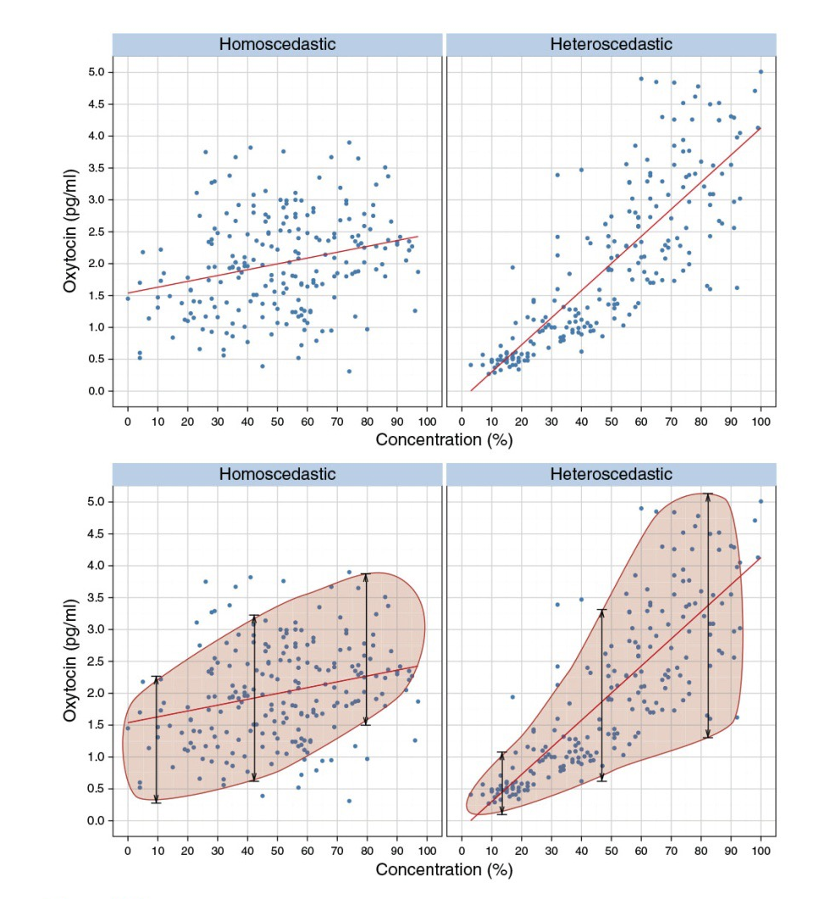

```{r xaringan-extra-styles, echo=FALSE}
library(xaringanExtra)
xaringanExtra::use_extra_styles(
  hover_code_line = TRUE,         #<<
  mute_unhighlighted_code = TRUE  #<<
)
```

```{html, echo=FALSE}
<div style = "position:fixed; visibility: hidden">
$$\require{color}\definecolor{yellow}{rgb}{1, 0.8, 0.16078431372549}$$
$$\require{color}\definecolor{orange}{rgb}{0.96078431372549, 0.525490196078431, 0.203921568627451}$$
$$\require{color}\definecolor{green}{rgb}{0, 0.474509803921569, 0.396078431372549}$$
</div>

<script type="text/x-mathjax-config">
MathJax.Hub.Config({
  TeX: {
    Macros: {
      yellow: ["{\\color{yellow}{#1}}", 1],
      orange: ["{\\color{orange}{#1}}", 1],
      green: ["{\\color{green}{#1}}", 1]
    },
    loader: {load: ['[tex]/color']},
    tex: {packages: {'[+]': ['color']}}
  }
});
</script>

<style>
.yellow {color: #FFCC29;}
.orange {color: #F58634;}
.green {color: #007965;}
</style>

```{r, echo=FALSE}
library(flair)
yellow <- "#FFCC29"
orange <- "#F58634"
green <- "#007965"
```


```{r setup, include=FALSE}
options(htmltools.dir.version = FALSE)
knitr::opts_chunk$set(
  fig.width=9, fig.height=3.5, fig.retina=3,
  out.width = "36%",
  tidy.opts=list(width.cutoff=60),tidy=TRUE, 
  cache = FALSE,
  echo = TRUE,
  message = FALSE, 
  warning = FALSE,
  fig.show = TRUE,
  hiline = TRUE
)

hook_source <- knitr::knit_hooks$get('source')
knitr::knit_hooks$set(source = function(x, options) {
  x <- stringr::str_replace(x, "^[[:blank:]]?([^*].+?)[[:blank:]]*#<<[[:blank:]]*$", "*\\1")
  hook_source(x, options)
})

```

<div style = "position:fixed; visibility: hidden">
$$\require{color}\definecolor{red}{rgb}{1, 0, 0}$$
$$\require{color}\definecolor{green}{rgb}{0, 1, 0}$$
$$\require{color}\definecolor{blue}{rgb}{0, 0, 1}$$
</div>

<script type="text/x-mathjax-config">
MathJax.Hub.Config({
  TeX: {
    Macros: {
      red: ["{\\color{red}{#1}}", 1],
      green: ["{\\color{green}{#1}}", 1],
      blue: ["{\\color{blue}{#1}}", 1]
    },
    loader: {load: ['[tex]/color']},
    tex: {packages: {'[+]': ['color']}}
  }
});
</script>

<style>
.red {color: #FF0000;}
.green {color: #00FF00;}
.blue {color: #0000FF;}
</style>


```{r flair_color, echo=FALSE}
library(flair)
red <- "#FF0000"
green <- "#00FF00"
blue <- "#0000FF"
```


```{r xaringan-themer, include=FALSE, warning=FALSE}
library(xaringanthemer)

style_solarized_dark(
  header_font_google = google_font("Work Sans"),
  header_h1_font_size = "36px",
  header_color = "black",
  text_font_google = google_font("Work Sans"),
  text_font_size = "28px",
  text_color = "black", 
  background_color = "white", 
  code_font_google = google_font("Share Tech Mono"),
  extra_css = list(
    ".remark-slide-content h2" = list(
      "margin-top" = "2em",
      "margin-bottom" = "2em"
    ),
    .big = list("font-size" = "150%"),
    .small = list("font-size" = "75%"),
    .subtle = list(opacity = "0.6"),
    ".countdown-has-style h3, .countdown-has-style h3 ~ p, .countdown-has-style h3 ~ ul" = list(
      "margin" = "0"
    ),
    ".countdown-has-style pre" = list(
      "margin-top" = "-10px"
    ),
    "p .remark-inline-code" = list(
      "background-color" = "white",
      "padding" = "2px 2px",
      "margin" = "0 -2px"
    ),
    blockquote = list("margin-left" = 0),
    "em" = list(color = "#2aa198")
  ),
)

```

```{r, echo=FALSE}
library(parameters)
library(papaja)
library(tidyverse)
library(performance)
library(equatiomatic)
library(kableExtra)
library(broom)
library(report)
library(huxtable)
library(skimr)
```
# Housekeeping

- Data 

  - Please let me know what data you intend to re-analyze (10/31)

- No more knowledge checks

  - Instead, you will submit 2-3 questions each week (Friday by 11:59 P.M.) over the material we have covered so far
  
    - What were 2-3 muddiest or unclear things from sessions this week? What are you still wondering about?
    
---
# Power and Effect Size

- Branson's Question

  - 95% CI for Cohen's d: [d − 1.96 × σ(d), d + 1.96 × σ(d)]
  
https://www.ncbi.nlm.nih.gov/pmc/articles/PMC5133225/
  
---
# Today

- Correlation

- Regression (linear modeling)
---
# Dataset 

- Mental Health and Drug Use:
    
    - CESD = depression measure
    - PIL total = measure of meaning in life
    - AUDIT total = measure of alcohol use 
    - DAST total = measure of drug usage

```{r}
master <- read_csv("https://raw.githubusercontent.com/jgeller112/psy503-psych_stats/master/static/slides/10-linear_modeling/data/regress.csv")

```
---
# Correlation (*r*)

- Quantifies relationship between two variables

  - Direction (positive or negative)

  - Strength 

- +1 is a perfect positive correlation
- 0 is no correlation (independence)
- -1 is a perfect negative correlation
---
# Correlations

```{r echo=FALSE,out.height="15%", out.width="70%",fig.cap="",fig.show='hold',fig.align='center'}


```
---
# Effect Size Heuristics

<br>
<br>

- *r* < 0.1	very small
- 0.1  ≤ *r* < 0.3	small
- 0.3   ≤ *r* < 0.5	moderate
- *r* ≥ 0.5	large
---
# Covariance and Correlation

- Pearson's *r*

<br>
<br>

$$covariance = \frac{\sum_{i=1}^n (x_i - \bar{x})(y_i - \bar{y})}{N - 1}$$
$$r = \frac{covariance}{s_xs_y} = \frac{\sum_{i=1}^n (x_i - \bar{x})(y_i - \bar{y})}{(N - 1)s_x s_y}$$
---
# Dataset

- CESD = depression measure

- PIL total = measure of meaning in life

  - What do you think relationship looks like?
  
--

```{r, fig.align='center', echo=FALSE, out.width="80%"}

# Animation
# Change the point sizes manually
anim.1<- ggplot(master, aes(x=PIL_total, y=CESD_total))+
   geom_point()

anim.1
```
---
# Statistical Test: Pearson's *r*

- $H_0$ *r* = 0 
- $H_1$ *r* $\not=$ 0

$$\textit{t}_r =  \frac{r\sqrt{N-2}}{\sqrt{1-r^2}}$$

```{r}
library(correlation) # easystats\

cor_result <- cor_test(master,"PIL_total", "CESD_total")

```

- Let's open R 

---
# Scatterplot 

```{r, echo=FALSE, fig.align='center',out.width="90%"}
plot(cor_result,
  point = list(
    aes = list(color = "CESD_total", size = "PIL_total"),
    alpha = 0.66
  ),
) +
  see::theme_modern() +
  see::scale_color_material_c(palette = "rainbow", guide = "none") +
  scale_size_continuous(guide = "none")
```
---
# Scatterplot

```{r, fig.align='center', out.width="100%"}

library(ggstatsplot)

ggstatsplot::ggscatterstats(master, 
                            x= "PIL_total", 
                            y="CESD_total")

```
---
# Non-paramteric Correlation

- Spearman’s rank correlation coefficient (ρ):

$$r_s = \frac{6 \sum d_i^2}{n(n^2 - 1)}$$

- It assesses how well the relationship between two variables can be described using a monotonic (increasing or decreasing) function

- Rank order method
- Range [-1,+1]

---
# Statistical Test: Spearman's *r*

```{r}
cor_result_s <- cor_test(master, "CESD_total", "PIL_total", method = "spearman")
```

- Let's go to R! 

---
# What is Linear Modeling?

- It is a model of the relationship between two or more variables

    - The model commonly used is a linear one
    
    - BUT! This does not preclude testing non-linear or non-additive effects

- A way of describing/explaining a phenomenon/relationship between variables

--
- A way of predicting the value of one variable from other variables
---
# Describing a Straight Line

- We describe the relationship between variables using the equation of a straight line

$$Y = mX + b$$
$$\begin{align}
Y &= \beta_0 + \beta_1 X + \varepsilon\\
\varepsilon &\sim N(0, \sigma^2)
\end{align}$$
---
# Describing a Straight Line

<br>
<br>
$$\red{Y_i} = \beta_0 + \beta_1 \green{X_i} + \blue{\varepsilon_i}$$

with

- .red[reponse variable]
- .green[predictor variable]
- .blue[error term]


---
# Regression Paramters

.pull-left[
- What is $b_1$?  

    - Regression coefficient for the predictor
    - Gradient (slope) of the regression line
    - Tells us how much we would expect y to change given a one-unit change in  x
    - Direction/Strength of Relationship
    
]

.pull-right[
- What is $b_0$?

    - Intercept (value of Y when X(s) = 0)
    - Point at which the regression line crosses the Y-axis
    
]
---
# The Best Fit Line and Least Squares

- Many lines could fit the data, but which is best?
 
  - The best fitting line is one that produces the "least squares", or minimizes the squared difference between X and Y 

- We use a method known as least squares to obtain estimates of $b_0$ and $b_1$ 
---
# The Relation Between Correlation and Regression

$$\hat{r} = \frac{covariance_{xy}}{s_x * s_y}$$

$$\hat{\beta_x} = \frac{covariance_{xy}}{s_x*s_y}$$

$$\hat{\beta_x} =  \frac{\hat{r} * s_x * s_y}{s_x} = r * \frac{s_y}{s_x}$$

$$\hat{\alpha} = \bar{y} - \hat{\beta_x}$$

---
class:middle

- What do squares have to do with it and why are they least squares?

---
# Visualizing Error

```{r, echo=FALSE, fig.align='center', out.width="100%"}

some_data <- data.frame(Y= c(1,2,4,3,5,4,6,5),
                        X= c(3,5,4,2,6,7,8,9)) %>%
  mutate(Y_pred = predict.lm(lm(Y~X))) %>%
  mutate(Y_error = Y - Y_pred)

ggplot(some_data, aes(x=X, y=Y))+
  geom_point()+
  geom_smooth(method='lm', se=FALSE)+
  geom_point(aes(y=Y_pred), color='red') +
  geom_segment(aes(xend = X, yend = Y-Y_error), alpha = .5)
```
---
# Visualize Errors as Squares

.pull-left[

```{r,echo=TRUE}

some_data <- data.frame(Y= c(1,2,4,3,5,4,6,5),
                        X= c(3,5,4,2,6,7,8,9)) %>%
  mutate(Y_pred = predict.lm(lm(Y~X))) %>%
  mutate(Y_error = Y - Y_pred)

g=ggplot(some_data, aes(x=X, y=Y))+
  geom_point()+
  geom_smooth(method='lm', se=FALSE)+
  geom_point(aes(y=Y_pred), color='red') +
  geom_segment(aes(xend = X, yend = Y-Y_error), alpha = .5)+
  geom_rect(aes(ymin=Y, 
                ymax=Y_pred, 
                xmin=X,
                xmax=X+Y_error), 
            alpha = .2)
```

]

.pull-right[

```{r, fig.align='center', echo=FALSE, out.width="100%", out.height="100%"}

some_data <- data.frame(Y= c(1,2,4,3,5,4,6,5),
                        X= c(3,5,4,2,6,7,8,9)) %>%
  mutate(Y_pred = predict.lm(lm(Y~X))) %>%
  mutate(Y_error = Y - Y_pred)

ggplot(some_data, aes(x=X, y=Y))+
  geom_point()+
  geom_smooth(method='lm', se=FALSE)+
  geom_point(aes(y=Y_pred), color='red') +
  geom_segment(aes(xend = X, yend = Y-Y_error), alpha = .5)+
  geom_rect(aes(ymin=Y, 
                ymax=Y_pred, 
                xmin=X,
                xmax=X+Y_error), 
            alpha = .2)+
  coord_cartesian(xlim=c(0,10),
                  ylim=c(0,10))
```

]
---
# Example

.pull-left[

<br>
<br>
```{r, echo=FALSE, message=FALSE, fig.align='center', out.width="100%", out.height="50%"}
library(ggplot2)
library(gganimate)
library(dplyr)

d <- mtcars
fit <- lm(mpg ~ hp, data = d)
d$predicted <- predict(fit)   # Save the predicted values
d$residuals <- residuals(fit) # Save the residual values

coefs<-coef(lm(mpg ~ hp, data = mtcars))

x<-d$hp
move_line<-c(seq(-6,6,.5),seq(6,-6,-.5))
total_error<-length(length(move_line))
cnt<-0
for(i in move_line){
  cnt<-cnt+1
  predicted_y <- coefs[2]*x + coefs[1]+i
  error_y <- (predicted_y-d$mpg)^2
  total_error[cnt]<-sqrt(sum(error_y)/32)
}

move_line_sims<-rep(move_line,each=32)
total_error_sims<-rep(total_error,each=32)
sims<-rep(1:50,each=32)

d<-d %>% slice(rep(row_number(), 50))

d<-cbind(d,sims,move_line_sims,total_error_sims)

anim<-ggplot(d, aes(x = hp, y = mpg)) +
  geom_abline(intercept = 30.09886+move_line_sims, slope = -0.06822828, aes(linetype='d'), color= 'red')+
  lims(x = c(0,400), y = c(-10,40))+
  geom_segment(aes(xend = hp, yend = predicted+move_line_sims, color="red"), alpha = .5) + 
  geom_point() +
  geom_rect(aes(ymin=predicted+move_line_sims, ymax=mpg, xmin=hp, xmax=hp+abs(predicted)+abs(residuals)+abs(move_line_sims), fill = total_error_sims), alpha = .2)+
  scale_fill_gradient(low="lightgrey", high="red")+
  geom_smooth(method = "lm", se = FALSE, color = "blue") + 
  theme_classic()+
  theme(legend.position="none")+
  xlab("X")+ylab("Y")+
  transition_manual(frames=sims)+
  enter_fade() + 
  exit_fade()+
  ease_aes('sine-in-out')

animate(anim,fps=5)
```
]

.pull-left[

- Shows two concepts:

  1. Regression line is "best fit line"
  
  2. The “best fit line” is the one that minimizes the sum of the squared deviations between each point and the line
]
---
# Worse Fit Lines

```{r,echo=FALSE, out.width="100%"}
some_data <- data.frame(Y= c(1,2,4,3,5,4,6,5),
                        X= c(3,5,4,2,6,7,8,9)) %>%
  mutate(Y_pred = predict.lm(lm(Y~X)))

some_data <- rbind(some_data,
                   some_data,
                   some_data,
                   some_data) %>%
  mutate(step = rep(1:4,each = 8),
         Y_pred = Y_pred + rep(c(.5,1,1.5,2), each = 8)) %>%
  mutate(Y_error = Y - Y_pred)

ggplot(some_data, aes(x=X, y=Y))+
  geom_smooth(method='lm', se=FALSE)+
  geom_point(aes(y=Y_pred), color='red') +
  geom_line(aes(x=X,y=Y_pred), color='red')+
  geom_point()+
  geom_segment(aes(xend = X, yend = Y-Y_error), alpha = .5)+
  geom_rect(aes(ymin=Y, 
                ymax=Y_pred, 
                xmin=X,
                xmax=X+Y_error), 
            alpha = .2)+
  coord_cartesian(xlim=c(0,10),
                  ylim=c(0,10)) +
  facet_wrap(~step)
```
---
# Simple Regression Example

- A linear model fit to data with a numeric $X$ is classical regression

  -  Depression scores and meaningfulness (in one's life)

```{r, fig.align='center', echo=FALSE, out.width="100%"}

# Animation
# Change the point sizes manually
anim.1<- ggplot(master, aes(PIL_total,CESD_total))+
   geom_point()+
  theme(legend.position="top")

anim.1
```

---

```{r, fig.align='center', out.width="100%", echo=FALSE}

#Animation
# Change the point sizes manually

#manually
anim.1<- ggplot(master, aes(PIL_total,CESD_total))+
   geom_point()+
  geom_smooth(method=lm, se=FALSE, fullrange=TRUE)


anim.1
```

---
# `lm()` in R


```{r}

lm_reg <-lm(master$CESD_total~master$PIL_total)

```

--

- How would we interpret this?

---
```{r, fig.align='center', echo=FALSE,out.width="100%"}

anim.1<- ggplot(master, aes(PIL_total,CESD_total))+
   geom_point()+
  geom_smooth(method=lm, se=FALSE, fullrange=TRUE) + 
  annotate("text",x=60,y=190,label=(paste0("slope==",coef(lm(master$CESD_total~master$PIL_total))[2])),parse=TRUE)+
  geom_vline(xintercept=0, linetype="dotted") + 
  geom_point(x=0, y=56, colour="red", size=5, shape=4)

anim.1
```
---
```{r, fig.align='center', echo=FALSE, out.width="100%"}
#Animation
# Change the point sizes manually
anim.1<- ggplot(master, aes(PIL_total,CESD_total))+
   geom_point()+
  geom_smooth(method=lm, se=FALSE, fullrange=TRUE) + 
  theme(legend.position="top") +
  annotate("text",x=60,y=190,label=(paste0("slope==",coef(lm(master$CESD_total~master$PIL_total))[2])),parse=TRUE)+
  geom_vline(xintercept=0, linetype="dotted") + 
  geom_point(x=0, y=56, colour="red", size=5, shape=4)

anim.1
```
---
$$CESD_{total} = 56 + (-.39)*PIL_{total}$$

```{r, fig.align='center', echo=FALSE, out.width="100%"}
library(ggpmisc)
#Animation
# Change the point sizes manually
anim.1<- ggplot(master, aes(PIL_total,CESD_total))+
   geom_point()+
  geom_smooth(method=lm, se=FALSE, fullrange=TRUE) + 
  theme(legend.position="top") +
  annotate("text",x=60,y=190,label=(paste0("slope==",coef(lm(master$CESD_total~master$PIL_total))[2])),parse=TRUE)+
  geom_vline(xintercept=0, linetype="dotted") + 
  geom_point(x=0, y=56, colour="red", size=5, shape=4)

anim.1
```
---
$$ \hat{CESD_{total}} = 56 + (-.39)*60$$
```{r, fig.align='center', echo=FALSE, out.width="100%"}

#Animation
# Change the point sizes manually
anim.1<- ggplot(master, aes(PIL_total,CESD_total))+
   geom_point()+
  geom_smooth(method=lm, se=FALSE, fullrange=TRUE) + 
  theme(legend.position="top") +
  annotate("text",x=60,y=190,label=(paste0("slope==",coef(lm(master$CESD_total~master$PIL_total))[2])),parse=TRUE)+
  geom_vline(xintercept=0, linetype="dotted") + 
  geom_point(x=0, y=56, colour="red", size=5, shape=4)+ 
  geom_point(x=60, y=33, colour="red", size=5, shape=4)

anim.1
```

---
# Residuals, Fitted Values, and Model Fit

<br>
<br>
<br>
- If we want to make inferences about the regression parameter estimates, then we also need an estimate of their variability 

- We also need to know how well are data fits the linear model

---
# SS Unexplained (Sums of Sqaures Error)

$$residual = y - \hat{y} = y - (x*\hat{\beta_x} + \hat{\beta_0})$$

$$SS_{error} = \sum_{i=1}^n{(y_i - \hat{y_i})^2} = \sum_{i=1}^n{residuals^2}$$

```{r, echo=FALSE, fig.align='center', out.width="80%"}
some_data <- data.frame(Y= c(1,2,4,3,5,4,6,5),
                        X= c(3,5,4,2,6,7,8,9)) %>%
  mutate(Y_pred = predict.lm(lm(Y~X))) %>%
  mutate(Y_error = Y - Y_pred)

(res_plot <- ggplot(some_data, aes(x=X, y=Y))+
  geom_point()+
  geom_smooth(method='lm', se=FALSE)+
  geom_segment(aes(xend = X, yend = Y-Y_error), alpha = .5)+
  geom_rect(aes(ymin=Y, 
                ymax=Y_pred, 
                xmin=X,
                xmax=X+Y_error), 
            alpha = .5,
            fill = "red")+
  coord_cartesian(xlim=c(0,10),
                  ylim=c(0,10))+
  theme_classic()+
  ggtitle("SS Unexplained (residual)")
  )

```

---
# SS Total (Sums of Sqaures Total) 

> Squared differences between the observed dependent variable and its mean. 

$$SS_{total} = \sum{(Y_i - \bar{Y})^2}$$

```{r, echo=FALSE, out.width="80%"}

some_data <- data.frame(Y= c(1,2,4,3,5,4,6,5),
                        X= c(3,5,4,2,6,7,8,9)) %>%
  mutate(Y_pred = mean(Y)) %>%
  mutate(Y_error = Y - Y_pred)

(total_plot <- ggplot(some_data, aes(x=X, y=Y))+
  geom_point()+
  geom_line(aes(y=Y_pred), color='black')+
  geom_segment(aes(xend = X, yend = Y-Y_error), alpha = .5)+
  geom_rect(aes(ymin=Y, 
                ymax=Y_pred, 
                xmin=X,
                xmax=X+Y_error), 
            alpha = .2)+
  coord_cartesian(xlim=c(0,10),
                  ylim=c(0,10))+
  theme_classic()+
  ggtitle("SS Total")
  )

```

---
# SS Explained (Sums of Squares Regression)

> The sum of the differences between the predicted value and the mean of the dependent variable

$$SS_{Explained} = \sum (Y'_i - \bar{Y})^2$$

```{r, echo=FALSE, fig.align='center', out.width="80%"}

some_data <- data.frame(Y= c(1,2,4,3,5,4,6,5),
                        X= c(3,5,4,2,6,7,8,9)) %>%
  mutate(Y_pred = predict.lm(lm(Y~X)),
         Y_mean = mean(Y)) %>%
  mutate(Y_error = Y - Y_pred,
         Y_total = Y-Y_mean)

(exp_plot <- ggplot(some_data, aes(x=X, y=Y))+
  geom_point()+
  geom_line(aes(y=Y_mean), color='black')+
  geom_smooth(method='lm', se=FALSE)+
  geom_segment(aes(xend = X, y = Y_mean, yend = Y_pred), color='black')+
  geom_rect(aes(ymin=Y_mean, 
                ymax=Y_pred, 
               xmin=X,
                xmax=X+(Y_pred - Y_mean)), 
            alpha = .5,
            fill = "blue")+
  coord_cartesian(xlim=c(0,10),
                  ylim=c(0,10))+
  theme_classic()+
  ggtitle("SS Explained (by Regression of X)"))
```
---
# All Together

```{r, fig.align='center', out.width="100%"}

library(patchwork)

(total_plot +plot_spacer())/(exp_plot+res_plot)+
  plot_annotation(title = 'SStotal = SSexplained + SSunexplained')

```
---
# `broom` Regression 

- tidy(): coefficent table
- glance(): model summary
- augment(): adds information about each observation

```{r}

library(broom) # install

```
---
# Regression: NHST 

$$H_0\colon \ \beta_1=0$$
$$H_1\colon \ \beta_1\ne0$$

$$\begin{array}{c}
t_{N - p} = \frac{\hat{\beta} - \beta_{expected}}{SE_{\hat{\beta}}}\\
t_{N - p} = \frac{\hat{\beta} - 0}{SE_{\hat{\beta}}}\\
t_{N - p} = \frac{\hat{\beta} }{SE_{\hat{\beta}}}
\end{array}$$
---
```{r}

model1 <- lm(master$CESD_total~master$PIL_total)
tidy(model1)


```
---
# Calculate Standard Error

$$MS_{error} = \frac{SS_{error}}{df} = \frac{\sum_{i=1}^n{(y_i - \hat{y_i})^2} }{N - p}$$

$$SE_{model} = \sqrt{MS_{error}}SE_{model} = \sqrt{MS_{error}}$$
$$SE_{\hat{\beta}_x} = \frac{SE_{model}}{\sqrt{{\sum{(x_i - \bar{x})^2}}}}$$

```{r, eval=FALSE}
# get MSE
# 1
mse=performance_mse(model1)
# 2 
SE<-sqrt(mse)
#3
x_de<- sum((master$CESD_total - mean(master$CESD_total))^2)

x_sqrt <- sqrt(x_de)

SE <- SE/x_sqrt

SE

```
---
# 95% CIs

$$b_1 \pm t^\ast (SE_{b_1})$$
```{r}
tidy(model1, conf.int = TRUE)
```

---
# Getting Residuals and Predicted Values

```{r}
assump=augment(model1)# residuals and fitted values
```
---
# Model Fit

```{r}

assump=glance(model1)#model fit indices

```
---
# Effect Size: $R^2$

- Coefficient of determination

$$R^2 = 1 - \frac{SS_{\text{error}}}{SS_{\text{tot}}}$$
$$R^2 = 1 - \frac{SS_{unexplained}}{SS_{Total}} = \frac{SS_{explained}}{SS_{Total}}$$

- Standardized effect size

  - Amount of variance explained
  
    - $R^2$ of .4 means 40% of variance in the outcome variable ($Y$) can be explained by the predictor ($X$)
  
  - Range: 0-1

---
# $R^2$
```{r}
library(performance)

rq2=r2(model1)

rq2=rq2$R2

SS_explained <- sum((assump$.fitted - mean(assump$`master$CESD_total`))^2)

SS_total <- sum((assump$`master$CESD_total` - mean(assump$`master$CESD_total`))^2)

r2<- SS_explained/SS_total

```
--
- $R^2$ of `r round(rq2, 3)` means 33% of variance in depressions scores is explained by meaning in life 
---
# $$R^2_{adj}$$


$$R^2_{adj} = 1 - \frac{SS_{unexplained}}{SS_{Total}} = \frac{SS_{explained}(n-K)}{SS_{Total}(n-1)}$$
where: 

- n = Sample size
- K = # of predictors

---
# Regression Model

- How useful are each of the individual predictors for my model?

    - Use the coefficients and t-tests of the slopes

- Is my overall model *(i.e., the regression equation)* useful at predicting the outcome variable?

    - Use the model summary, F-test, and $R^2$
---
# Overall Model Significance

- Our overall model uses an *F*-test
 
- However, we can think about the hypotheses for the overall test being:

    - $H_0$: We cannot predict the dependent variable (over and above a model with only an intercept)
    
    - $H_1$: We can predict the dependent variable ( over and above a model with only an intercept)
    
- Generally, this form does not include two tailed tests because the math is squared, so it is impossible to get negative values in the statistical test

---
# F-distribution

```{r, echo=FALSE, fig.align='center', out.width="60%"}

knitr::include_graphics('images/fdis.png')

```
---
# F-Statistic, Explained Over Unexplained

- F-statistics use measures of variance, which are sums of squares divided by relevant degrees of freedom

$$F = \frac{SS_{Explained}/df1 (p-1)}{SS_{Unexplained}/df2(n-p)} = \frac{MS_{Explained}}{MS_{Unexplained}}$$

- If explained = unexplained, then F=1

- If explained > then, F >1 

- If explained < unexplained, F < 1

---
# Calculating Mean Squares in R

```{r}
#use augment to get fitted and resid information
SS_explained <- sum((assump$.fitted - mean(assump$`master$CESD_total`))^2)

SS_unexplained <- sum((assump$`master$CESD_total` - assump$.fitted)^2)

# easier solution
ms_error <- performance_mse(model1)

#TSS?

```

---
# Linear Modeling Assumptions

1. Linearity

2. Independence of errors

  - There is not a relationship between the residuals and the variable  

3. Normality of errors (on the residuals)

4. Equal variances (Homoscedacity)

  - The variance of the residuals is the same for all values of X
---
# Assumptions: Linearity

```{r, echo=FALSE, fig.align='center', out.width="100%"}
anim.1<- ggplot(master, aes(CESD_total,PIL_total))+
   geom_point()+
  theme(legend.position="top")

anim.1
```
---
# Assumptions: Normality of Errors

- Shaprio test

- QQ-Plot

```{r, fig.align='center', out.width="50%"}
assump=augment(model1)# residuals and fitted values

  ggplot(assump, aes(sample = .resid)) +
  stat_qq() +
  stat_qq_line() +
  theme_classic()
```

---
# Assumptions: Equal Variances and Independence 

.pull-left[

```{r, fig.align='center', out.width="100%"}
  ggplot(assump, aes(x = .fitted, y = .resid)) +
  geom_point(size = 3, alpha = 0.7) +
  theme_classic()
```

]

.pull-right[

```{r echo=FALSE, out.width="100%",fig.cap="",fig.show='hold',fig.align='center'}


```


]
---
# Reporting

- `r report(model1)`
---
class: middle

# Linear Modeling with Multiple Continuous Predictors

---
# Simple Linear Model

```{r echo=FALSE, out.width="50%",fig.cap="",fig.show='hold',fig.align='center'}

knitr::include_graphics('images/Pxy.png')
```
---
# Multiple Predictors in Linear Regression

```{r echo=FALSE, out.width="30%",fig.cap="",fig.show='hold',fig.align='center'}

knitr::include_graphics('images/xymult.png')
```
---
# Multiple Regression Example

$$\begin{align}
Y &= \beta_0 + \beta_1 X + \varepsilon\\
\varepsilon &\sim N(0, \sigma^2)
\end{align}$$

 $$\hat{Y}_i = b_0 + b_1X_1i + b_2X_2i + b_3X_3i+...+B_kX_k \varepsilon_i$$
 
- Simple as adding predictors to our linear equation

---
# Multiple regression equation

$$\hat{Y}_i = b_0 + b_1X_1i + b_2X_2i + b_3X_3i+...+B_kX_k \varepsilon_i$$
 
- $\hat{Y}$ = predicted value on the outcome variable Y
- $B_0$ = predicted value on Y when all Xs = 0
- $X_k$ = predictor variables
- $b_k$ = unstandardized regression coefficients
- $k$ = the number of predictor variables

---
# Straight Line to Hyperplane

.pull-left[
-  2 predictors - 2-D Plane in 3-D

- Intercept α ($b_0) predicts where the regression plane crosses the Y axis

- Slope for variable X1 ($b_1$) predicts the change in Y per unit X1 holding X2 constant

- The slope for variable X2 ($b_2$) predicts the change in Y per unit X2 holding X1 constant
]

.pull-right[

```{r echo=FALSE, out.width="100%",fig.cap="",fig.show='hold',fig.align='center'}


```
]
---
# Multiple Regresson: Example 

```{r}
model2 <- lm(CESD_total~PIL_total + AUDIT_TOTAL_NEW + DAST_TOTAL_NEW, data=master)

```

$$\operatorname{CESD\_total} = \alpha + \beta_{1}(\operatorname{PIL\_total}) + \beta_{2}(\operatorname{AUDIT\_TOTAL\_NEW}) + \beta_{3}(\operatorname{DAST\_TOTAL\_NEW}) + \epsilon$$
- Mental Health and Drug Use:
    
    - CESD = depression measure
    - PIL total = measure of meaning in life
    - AUDIT total = measure of alcohol use 
    - DAST total = measure of drug usage
---

# Scatterplot

```{r, fig.align='center', out.width="80%"}
# Change the point sizes manually

anim.1<- ggplot(master, aes(x=AUDIT_TOTAL_NEW, y=CESD_total))+
   geom_point()

anim.1
```
---
# Scatterplot

```{r, fig.align='center', out.width="80%"}
# Change the point sizes manually

anim.1<- ggplot(master, aes(x=DAST_TOTAL_NEW, y=CESD_total))+
   geom_point()

anim.1
```
---
# Linear Model Assumptions (multiple predictors)

- Linearity
- Independence of residuals
- Normality of residuals
- Equal error (“homoskedasticity”)
- Additive (more than one variable)

Problems: 
- Missingness
- Factors are not correlated with one another(multicollinearity) (more than one variable)
- No outliers
---
# Problems

- Missingness

```{r}
summary(master)
nomiss <- na.omit(master)
nrow(master)
nrow(nomiss)
```
---
# Problems

- Multicolinearity 

  - You want X and Y to be correlated

  - You do not want the Xs to be highly correlated

---
# Multicolinearity 

- Problems

  - Extreme cases (complete collinearity) = Nonidentifiable model
  
    - “Unstable” regression coefficients ("Bouncing betas")
    
    - Large standard errors

---
# Multicolinearity

- Tolerance 

$$tolerance=1- R^2$$

- VIF (variance inflation factor)
  
$$VIF=\frac{1}{1- R^2}$$
  - Rule of thumb:
  
    -  >10 indicates issues
---
# Multicolinearity

- Strategies

  - Anticipate collinearity issues at the design stage
  
  - Depends: Drop variable if there’s no theoretical pay-off anyway
  
  - Depends: Fit separate models and compare fit
  
  - Depends: Increase sample size
  
  - Depends: Orthogonalize predictors experimentally
  
  - Depends: Use alternative approaches, such as ridge regression or LASSO
  
*Do not residualize*

---
# Problems

- Check multicolinearity in your data

```{r, fig.align='center', out.width="80%"}
#easystats performance package
plot(check_collinearity(model2))
```
---
# Problems: Influential points

- A few outlier checks:

    - Mahalanobis
    - Leverage scores
    - Cook's distance

---
# Mahalanobis Distance 

- The `mahalanobis()` function 

- Since we are going to use multiple criteria, we are going to save if they are an outlier or not

- The table tells us: 0 (not outliers) and 1 (considered an outlier) for just Mahalanobis values

```{r echo=TRUE, message=FALSE, eval=TRUE, warning=FALSE}
mahal <- mahalanobis(nomiss, 
                    colMeans(nomiss), 
                    cov(nomiss))
cutmahal <- qchisq(1-.001, ncol(nomiss))
badmahal <- as.numeric(mahal > cutmahal) ##note the direction of the > 
table(badmahal)
```
---
# Other Outliers

- To get the other outlier statistics, we have to use the regression model we wish to test. 

- We will use the `lm()` function with our regression formula

- So we will predict depression scores (CESD) with meaning, drugs, and alcohol 

```{r echo=TRUE, message=FALSE, warning=FALSE}
model3 <- lm(CESD_total ~ PIL_total + AUDIT_TOTAL_NEW + DAST_TOTAL_NEW,
             data = nomiss)
```

---
# Leverage 

- Influence of that data point on the slope

- Each score is the change in slope if you exclude that data point

- How do we calculate how much change is bad?

    - $\frac{2K+2}{N}$
    - K is the number of predictors
    - N is the sample size 
---
# Leverage 

```{r echo=TRUE, message=FALSE, warning=FALSE}
k <- 3 ##number of IVs
leverage <- hatvalues(model3)
cutleverage <- (2*k+2) / nrow(nomiss)
badleverage <- as.numeric(leverage > cutleverage)
table(badleverage)
```
---
# Cook's Distance 

- Influence **(Cook's Distance)** 

  - A measure of how much of an effect that single case has on the whole model 
  
  - Often described as leverage + discrepancy 
- How do we calculate how much change is bad?
  
    - $\frac{4}{N-K-1}$

```{r echo=TRUE, message=FALSE, warning=FALSE}
cooks <- cooks.distance(model3)
cutcooks <- 4 / (nrow(nomiss) - k - 1)
badcooks <- as.numeric(cooks > cutcooks)
table(badcooks)
```
---
# Combine Outlier Metrics

- What do I do with all these numbers?

- Create a total score for the number of indicators a data point has

- You can decide what rule to use, but a suggestion is 2 or more indicators is an outliers

```{r echo=TRUE, message=FALSE, warning=FALSE}
##add them up!

totalout <- badmahal + badleverage + badcooks

table(totalout)

noout <- filter(nomiss, totalout <= 2)

```
---
# Run Model Again 

- Now that we got rid of outliers, we need to run that model again, without the outliers

```{r echo=TRUE, message=FALSE, warning=FALSE}
model4 <- lm(CESD_total ~ PIL_total + AUDIT_TOTAL_NEW + DAST_TOTAL_NEW, 
             data = noout)
```
---
# Assumptions

  - Additivity
  
    - Implies that for an existing model, the effect of a predictor on a response variable (whether it be linear or non-linear) is not affected by changes in other existing predictors
    


---
# Assumptions

- Linearity

  - Check (use a plot) that your variables are linearly related
  
```{r, echo=TRUE, fig.align='center', out.width="60%"}

library(GGally)
ggpairs(master)
```
---
# Assumptions

- Normality

**Applies to residuals and not the distribution of the data**
  
```{r echo=TRUE, message=FALSE, warning=FALSE, fig.align='center', out.width="70%"}
model4 <- lm(CESD_total ~ PIL_total + AUDIT_TOTAL_NEW + DAST_TOTAL_NEW,
             data = noout)

plot(check_normality(model4))
```

---
# Assumptions

.pull-left[
- Homogeneity & Homoscedasticity

  - Constant error variance
  ]
.pull-right[
```{r, fig.align='center', out.width="80%"}

```
]
---
# Assumptions

- Homogeneity & Homoscedasticity

  - Uses Levene's test (we know that one) or Bartlett's test

```{r, eval=FALSE}
#easystats
performance::check_homogeneity(model4)
```

---
# Check Assumptions

```{r, message=FALSE}
check_normality(model4)
check_heteroscedasticity(model4)
check_collinearity(model4)
```
---
# Check Assumptions

```{r echo=FALSE, out.width="50%",fig.cap="",fig.show='hold',fig.align='center'}


```
---
# Assumption Alternatives

- If your assumptions go wrong:

    - Linearity - try nonlinear regression or nonparametric regression
    
    - Normality - more subjects, still fairly robust
    
    - Homogeneity/Homoscedasticity - bootstrapping
    
      - Use robust methods for SE
        - model_parameters(model, vcov = "HC3")
    
    - Multicolineary - drop one of the predictors; ridge regression; lasso regression
---
# Individual Predictors

- We test the individual predictors with a t-test:
  
    - $t = \frac{b}{SE}$
    
    - Therefore, the model for each individual predictor is our coefficient b
    
    - Single sample t-test to determine if the b value is different from zero
    
---
# Linear Model with Multiple Predictors: NHST

- All slopes

$$ b_1 = b_2 = b_3 = 0$$
$$b_1 \neq b_2 \neq b_3$$
- Or at least one of the slopes is not 0 
---
# Overall Model Fit

- Is the overall model significant?

```{r}
summary(model4)
```

---
```{r}
library(papaja)
apa_style <- apa_print(model4)
apa_style$full_result$modelfit
```
- `r apa_style$full_result$modelfit`
---
# Predictors

- What about the predictors?

```{r}
summary(model4) %>%
tidy()
```
---
# Predictors

```{r}
apa_style$full_result$PIL_total
apa_style$full_result$AUDIT_TOTAL_NEW
apa_style$full_result$DAST_TOTAL_NEW
```

- Meaning: `r apa_style$full_result$PIL_total`
- Alcohol: `r apa_style$full_result$AUDIT_TOTAL_NEW`
- Drugs: `r apa_style$full_result$DAST_TOTAL_NEW`
---
# Predictors

- Two concerns:

    - What if I wanted to use beta because these are very different scales?
    
    - What about an effect size for each individual predictor?
---
# Individual Predictors: Standardization 

- b = unstandardized regression coefficient

    - For every one unit increase in X, there will be b units increase in Y.

- $\beta$ = standardized regression coefficient

    - b in standard deviation units
    - For every one SD increase in X, there will be $\beta$ SDs increase in Y
    
- b or $\beta$?:

    - b is more interpretable given your specific problem
    
    - $\beta$ is more interpretable given differences in scales for different variables
---
# Beta

```{r}
#easystats
library(parameters)
standardize_parameters(model2)
```
---
# The Impact of Individual Predictors on the Model: Effect Size

.pull-left[
- R is the multiple correlation
- $R^2$ is the multiple correlation squared
- All overlap in Y, used for overall model
- $A+B+C/(A+B+C+D)$
]

.pull-right[
```{r, echo = FALSE, out.width="100%", fig.align='center'}
knitr::include_graphics("https://raw.githubusercontent.com/doomlab/learnSTATS/master/vignettes/pictures/regression/19.PNG")
```
]
---
# Effect Size 

.pull-left[
- sr is the semi-partial correlations 

- Unique contribution of IV to $R^2$ for those IVs

- Increase in proportion of explained Y variance when X is added to the equation

- $A/(A+B+C+D)$
]

.pull-right[
```{r, echo = FALSE, out.width="100%", fig.align='center'}
knitr::include_graphics("https://raw.githubusercontent.com/doomlab/learnSTATS/master/vignettes/pictures/regression/19.PNG")
```
]
---
# Effect Size 

.pull-left[

- pr is the partial correlation

- Partial correlation asks how much of the Y variance, which is not estimated by the other IVs, is estimated by this variable.

- $A/(A+D)$

- Removes the shared variance of the control variable (Say X2) from both Y and X1

- Pr > sr
]

.pull-right[

```{r, echo = FALSE, out.width="100%", fig.align='center'}
knitr::include_graphics("https://raw.githubusercontent.com/doomlab/learnSTATS/master/vignettes/pictures/regression/19.PNG")
```
]
---
# Partial Correlations

- We would add these to our other reports:

    - Meaning: `r apa_style$full_result$PIL_total`, $pr^2 = .30$`
    - Alcohol: `r apa_style$full_result$AUDIT_TOTAL_NEW`, $pr^2 < .01$`
    - Drugs: `r apa_style$full_result$DAST_TOTAL_NEW`, $pr^2 < .01$`

```{r echo=TRUE, message=FALSE, warning=FALSE}
library(ppcor)
partials <- pcor(noout)
partials$estimate^2

#spcor.test (semi-partial)
```

---
# Multiple Regression: Power

- We can use the `pwr` library to calculate the required sample size for any particular effect size

- First, we need to convert the $R^2$ value to $f^2$, which is a different effect size, not the ANOVA *F*

```{r echo=TRUE, message=FALSE, warning=FALSE}
library(pwr)
R2 <- model2$r.squared
f2 <- R2 / (1-R2)
R2
f2
```
---
# Multiple Regression: Power

- `u` is degrees of freedom for the model, first value in the F-statistic
- `v` is degrees of freedom for error, but we are trying to figure out sample size for each condition, so we leave this one blank. 
- `f2` is the converted effect size.
- `sig.level` is our $\alpha$ value
- `power` is our power level
- The final sample size is *v + k + 1 where k is the predictors*

```{r, eval=FALSE}
#f2 is cohen f squared 
pwr.f2.test(u = model2$df[1], 
            v = NULL, f2 = f2, 
            sig.level = .05, power = .80)
```

