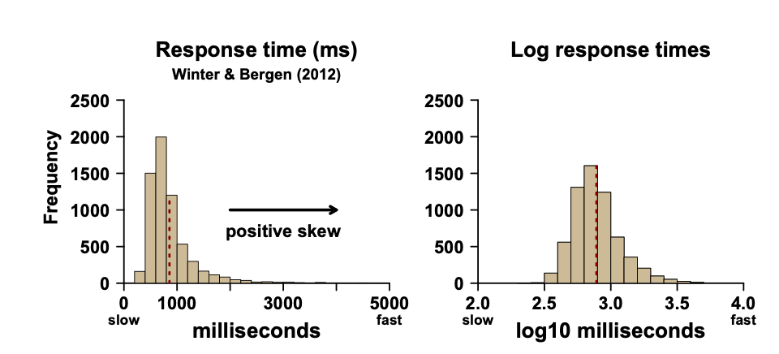
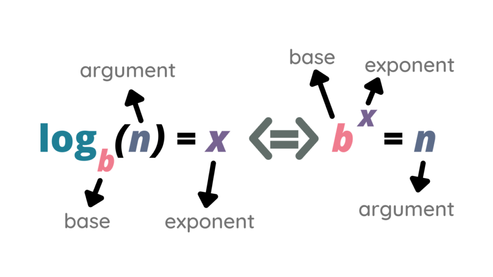
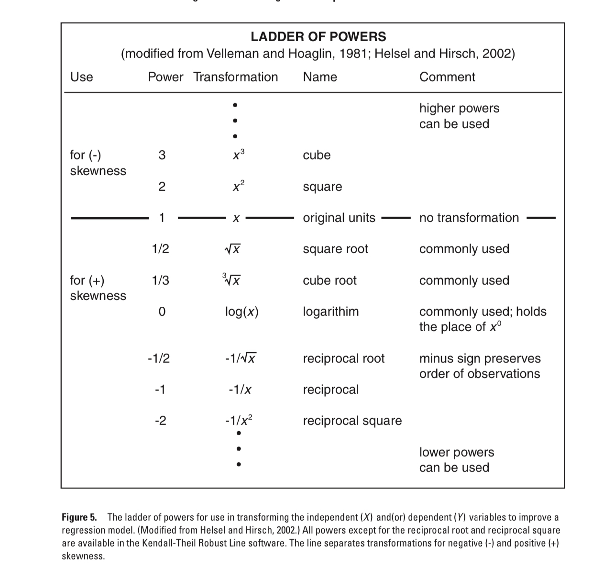
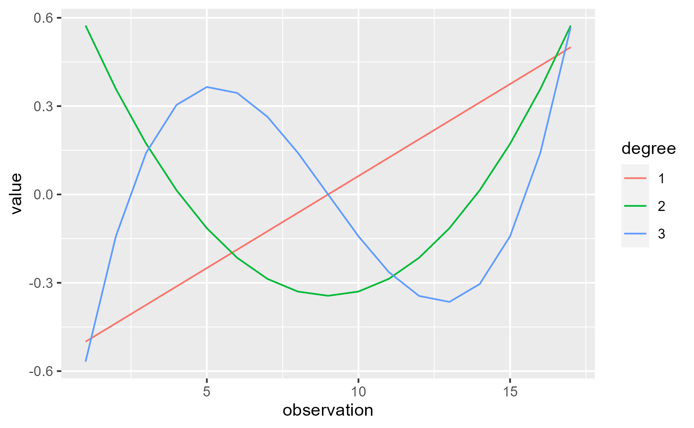

```{r xaringan-extra-styles, echo=FALSE}
library(xaringanExtra)
xaringanExtra::use_extra_styles(
  hover_code_line = TRUE,         #<<
  mute_unhighlighted_code = TRUE  #<<
)
```

```{html, echo=FALSE}
<div style = "position:fixed; visibility: hidden">
$$\require{color}\definecolor{yellow}{rgb}{1, 0.8, 0.16078431372549}$$
$$\require{color}\definecolor{orange}{rgb}{0.96078431372549, 0.525490196078431, 0.203921568627451}$$
$$\require{color}\definecolor{green}{rgb}{0, 0.474509803921569, 0.396078431372549}$$
</div>
<script type="text/x-mathjax-config">
MathJax.Hub.Config({
  TeX: {
    Macros: {
      yellow: ["{\\color{yellow}{#1}}", 1],
      orange: ["{\\color{orange}{#1}}", 1],
      green: ["{\\color{green}{#1}}", 1]
    },
    loader: {load: ['[tex]/color']},
    tex: {packages: {'[+]': ['color']}}
  }
});
</script>
<style>
.yellow {color: #FFCC29;}
.orange {color: #F58634;}
.green {color: #007965;}
</style>
```{r, echo=FALSE}
library(flair)
yellow <- "#FFCC29"
orange <- "#F58634"
green <- "#007965"
```


```{r setup, include=FALSE}
options(htmltools.dir.version = FALSE)
knitr::opts_chunk$set(
  fig.width=9, fig.height=3.5, fig.retina=3,
  out.width = "50%",
  tidy.opts=list(width.cutoff=60),tidy=TRUE, 
  cache = FALSE,
  echo = TRUE,
  message = FALSE, 
  warning = FALSE,
  fig.show = TRUE,
  hiline = TRUE
)
hook_source <- knitr::knit_hooks$get('source')
knitr::knit_hooks$set(source = function(x, options) {
  x <- stringr::str_replace(x, "^[[:blank:]]?([^*].+?)[[:blank:]]*#<<[[:blank:]]*$", "*\\1")
  hook_source(x, options)
})
```

<div style = "position:fixed; visibility: hidden">
$$\require{color}\definecolor{red}{rgb}{1, 0, 0}$$
$$\require{color}\definecolor{green}{rgb}{0, 1, 0}$$
$$\require{color}\definecolor{blue}{rgb}{0, 0, 1}$$
</div>

<script type="text/x-mathjax-config">
MathJax.Hub.Config({
  TeX: {
    Macros: {
      red: ["{\\color{red}{#1}}", 1],
      green: ["{\\color{green}{#1}}", 1],
      blue: ["{\\color{blue}{#1}}", 1]
    },
    loader: {load: ['[tex]/color']},
    tex: {packages: {'[+]': ['color']}}
  }
});
</script>

<style>
.red {color: #FF0000;}
.green {color: #00FF00;}
.blue {color: #0000FF;}
</style>


```{r flair_color, echo=FALSE}
library(flair)
red <- "#FF0000"
green <- "#00FF00"
blue <- "#0000FF"
```


```{r xaringan-themer, include=FALSE, warning=FALSE}
library(xaringanthemer)
style_solarized_dark(
  header_font_google = google_font("Work Sans"),
  header_h1_font_size = "36px",
  header_color = "black",
  text_font_google = google_font("Work Sans"),
  text_font_size = "30px",
  text_color = "black", 
  background_color = "white", 
  code_font_google = google_font("Share Tech Mono"),
  extra_css = list(
    ".remark-slide-content h2" = list(
      "margin-top" = "2em",
      "margin-bottom" = "2em"
    ),
    .big = list("font-size" = "150%"),
    .small = list("font-size" = "75%"),
    .subtle = list(opacity = "0.6"),
    ".countdown-has-style h3, .countdown-has-style h3 ~ p, .countdown-has-style h3 ~ ul" = list(
      "margin" = "0"
    ),
    ".countdown-has-style pre" = list(
      "margin-top" = "-10px"
    ),
    "p .remark-inline-code" = list(
      "background-color" = "white",
      "padding" = "2px 2px",
      "margin" = "0 -2px"
    ),
    blockquote = list("margin-left" = 0),
    "em" = list(color = "#2aa198")
  ),
)
```

```{r, echo=FALSE}
library(parameters)
library(effectsize) 
library(papaja)
library(tidyverse)
library(performance)
library(see)
library(equatiomatic)
library(kableExtra)
library(broom)
library(report)
library(flextable)
library(huxtable)
library(skimr)
library(papaja)

senses <- read_csv("https://raw.githubusercontent.com/jgeller112/psy503-psych_stats/master/static/slides/11-Categorical%20Predictors/data/winter_2016_senses_valence.csv")

data = read_csv("https://raw.githubusercontent.com/jgeller112/psy503-psych_stats/master/static/slides/10-linear_modeling/data/age_pitch.csv")

df <- mutate(data,
             age_c = age - mean(age, na.rm = TRUE), # center
             age_z = age_c / sd(age, na.rm = TRUE))# standardize

```
# Outline

- Check-In Q&A

- Transformations

  - Linear Transformations

     - Centering
     - Standardization
    
  - Nonlinear Transformations
  
      - Logarithms
      
- Polynomial regression

---
# Check-In Q&A

1. Can a model be too good?

2. What is a grand mean?

3. Intercept of the linear model

4. In effects coding/sum coding, why is centering necessary? 

5. $\eta^2$ vs $\eta_p^2$

6. Would you ever use dummy coding with multiple levels? 
---
# Check-in Questions

- How many predictors is too many?

--

.pull-left[

- General rule of thumb is 10-20 participants for every predictor variable in your model

- Use cross validation

- Use other methods like lasso or ridge regression

- Only include predictors that are theoretically meaningful
]

.pull-right[
```{r, echo=FALSE, fig.align='center', out.width="100%"}
knitr::include_graphics("Overfitting-1.png")
```
]
---
- What is grand mean?

- It is the mean of the means

$$\frac{Group1_{mean} + Group2_{mean}}{2}$$
```{r}

senses %>%
  group_by(Modality) %>% # get each group
  dplyr::summarise(meanval=mean(Val))%>% # get mean
 dplyr::summarise(meanofmeans=mean(meanval)) # mean of means

```
---
- Sum of Squares

```{r, echo=FALSE, fig.align='center', out.width="70%"}

knitr::include_graphics("aov_table.bmp")
```
---
# Restricted and Full Model

$$F = \frac{SS_{R}-SS_{F}/{df_{R}-df_{F}} (p-1)}{SS_{F}/df_F(N-p)} = \frac{MS_{model}}{MS_{error}}$$


```{r}

restricted <- lm(Val~ 1, data=senses) # intercept-only model

full <- lm(Val~Modality, data=senses)  # full model 

```
---
# Weekly Check-In Questions

- Significance of the intercept value

  -  The *p*-value for the intercept tells us if the intercept is different from 0
  
    - Most often this is not of importance 

$$H_0:\beta_0=0$$
---
# Weekly Check-In Questions

- In effects coding/sum coding, why is centering necessary/why would we want to use grand mean?

  - Centering is what occurs as a function of taking the mean of dummy codes 
  
  - Might not care about reference level 

- When dealing with one factor with 2 levels dummy coding vs. sum coding does not matter
  
- Sum coding is what ANOVA is doing to test main effects and interactions (more on this later)

---
# Weekly Check-In Questions

---
# Weekly Check-In Questions

- Eta-squared vs partial eta-squared 
$$\eta^2$$

- % of total variance explained by IV

$$\eta_p^2$$

- % of variance explained by IV partailing out other variables in the model

---
# Weekly Check-In Questions

-  Would you ever use dummy coding with multiple levels? 

```{r, echo=FALSE}
senses <- read_csv("https://raw.githubusercontent.com/jgeller112/psy503-psych_stats/master/static/slides/11-Categorical%20Predictors/data/winter_2016_senses_valence.csv")
lm(Val~Modality, data=senses) %>%
tidy()
```
---
# Dummy Codes (Seidman, Wade, & Geller, 2022)

  -  Waitlist (do not complete a group, just measures)
  -  Group-only (attend a group + measures)
  
  - Self-affirmation + group (complete an individual intervention, then attend group, + measures)  

    - GOvsSA = Waitlist (0), Group only (0), Self-affirmation (1)

   - WLvsGO = Waitlist (0), Group only (1) Self-affirmation (1)

    - GroupvsNo = Waitlist (0), Group (1), Self-Affirmation (1) 

---
# `emmeans`

- Get means and pairwise comparisons

```{r, echo=TRUE, eval=TRUE}
# get pairwise tests between all groups

sen <- lm(Val~Modality, data=senses)

as.data.frame(emmeans::emmeans(sen, specs = "Modality")) %>%
flextable()

```

---
# Pairwise Comparisons

```{r, echo=TRUE}
library(flextable)
# get pairwise tests between all groups
means1 = emmeans::emmeans(sen, specs = "Modality")
# use pairs
flextable(as.data.frame(pairs(means1)))
```
---
# Today's Datasets

  - Pitch and Age

```{r, message = FALSE, warning = FALSE}

data = read_csv("https://raw.githubusercontent.com/jgeller112/psy503-psych_stats/master/static/slides/10-linear_modeling/data/age_pitch.csv")

```
---
# Today's Datasets

- Memory and Time

 - 13 subjects were asked to memorize a list of disconnected items
 
 - The subjects were then asked to recall the items at various times up to a week later 

```{r}

log_df <- tibble::tribble(
   ~time, ~prop,
      1L,  0.84,
      5L,  0.71,
     15L,  0.61,
     30L,  0.56,
     60L,  0.54,
    120L,  0.47,
    240L,  0.45,
    480L,  0.38,
    720L,  0.36,
   1440L,  0.26,
   2880L,   0.2,
   5760L,  0.16,
  10080L,  0.08
  )
```
---
# Transformations

- When should we transform our data?

  - To make our data more *interpretable*
  
--

  - When our data is *non-linear*

--

  - When our data is *skewed* 
  
---
# Linear Transformations

- Linear transformations

  - Adding, subtracting, dividing by, or multiplying a variable with a constant
    
  - Does not change the relationships in a genuine way (“same model”)


---
# Linear Transformations

- Linear transformations

  - Adding, subtracting, dividing by, or multiplying a variable with a constant
  
  - Does not change the relationships in a genuine way (“same model”)
  
    - Common: centering and standardizing
---
# Transformations

- Nonlinear transformations

--

   - Transformation that affects different data points differently
  
  - Changes the relationships (“different model”)
  
      - Common: Logarthims 
    
  - Makes models more in line with assumptions
---
# Linear Transformations

```{r, fig.align='center', out.width="100%", echo=FALSE}
#manually
anim.1<- ggplot(data, aes(age,pitch))+
   geom_point(size=5)+
  geom_smooth(method=lm, se=FALSE, fullrange=TRUE, size=3)+
  theme_bw(base_size=16)

anim.1

```
---
# Linear Transformations

```{r, fig.align='center', echo=FALSE, out.width="100%"}
#Animation
# Change the point sizes manually
anim.1<- ggplot(data, aes(age,pitch))+
  geom_point(size=5)+
  geom_smooth(method=lm, se=FALSE, fullrange=TRUE, size=5)+
  theme_bw(base_size=16) +
  geom_vline(xintercept=0, linetype="dotted") + 
  geom_point(x=0, y=216, colour="red", size=10, shape=22, fill="red") + 
  expand_limits(x = 0)
anim.1
```
---
# Centering

> Sometimes our data is *nonsensical* (e.g., Intercept when Age = 0)

- Centering changes the model so that 0 is mean/average of X

```{r, fig.align='center', echo=FALSE, out.width="100%"}
#Animation# Change the point sizes manually #center
data$age_c <- data$age-mean(data$age)

anim.1<- ggplot(data, aes(age_c,pitch))+
  geom_point(size=5)+
  geom_smooth(method=lm, se=FALSE, fullrange=TRUE, size=5)+
  theme_bw(base_size=20) +
  geom_vline(xintercept=0, linetype="dotted") + 
  geom_point(x=0, y=175, colour="red", size=10, shape=22, fill="red")+ 
  expand_limits(x = 0)

anim.1
```
---
# Centering - How?

```{r}
df <- mutate(data,
             age_c = age - mean(age, na.rm = TRUE)) # center
```

```{r}
library(datawizard) # package to center and standardize

df_wiz <- data %>% 
  mutate(age_c = datawizard::center(age))


head(df_wiz)
```
---
# Standardize Predictors 

- Dividing centered mean by $\sigma$

- Puts variables on same metrics 

```{r, fig.align='center', echo=FALSE, out.width="100%"}
#Animation
# Change the point sizes manually
df_wiz <- data %>% 
  mutate(
          # center
             age_z = datawizard::standardize(age))

anim.1<- ggplot(df_wiz, aes(age_z,pitch))+
  geom_point(size=5)+
  geom_smooth(method=lm, se=FALSE, fullrange=TRUE, size=5)+
  theme_bw(base_size=20) +
  geom_vline(xintercept=0, linetype="dotted") + 
  geom_point(x=0, y=175, colour="red", size=10, shape=22, fill="red") + 
  expand_limits(x = 0)
  

anim.1
```
---
# Standardizing - How?

```{r}
df_stand <- data %>%
  mutate(age_z = age_c / sd(age, na.rm = TRUE))# standardize z score
```

```{r, echo=FALSE}
df_wiz <- mutate(data,
             age_z = datawizard::standardize(age))

head(df_wiz)
```
---
# Output

```{r}
lm(pitch~age, data=data)
```


.pull-left[

```{r}
lm(pitch~age_c, data=df)
```
]

.pull-right[
```{r}
lm(pitch~age_z, data=df_wiz)
```
]
---
# Centering Around Other Values

- We could also make 0 correspond to some other sensible/useful value

  - Smallest logically possible value?

---
# Centering

  - Good if zero is *not meaningful*
  
  - Do not center if zero is meaningful
  
---
class: middle

# When in doubt, center!

---
class: middle

# Nonlinear Transformations

---
# Logathimthic Transformations 

```{r, echo=FALSE, fig.align='center', out.width="90%"}



```
---
# Logathimthic Transformations 

```{r, echo=FALSE, fig.align='center', out.width="90%"}



```
---
# Logathimthic Transformations 

- Exponentiation

  - Takes small numbers and grows them 

$$10^1 = 10$$
$$10^2 = 100$$
$$10^3 = 1000$$
$$10^4 = 10000$$
$$10^5 = 100000$$
---
# Log Transformations

- Logarithmic

  - How many times must one “base” number be multiplied by itself to get some other particular number?

  - Takes large numbers and shrinks them 

$$1 = log_{10}(10)$$
$$2 = log_{10}(100)$$
$$3 = log_{10}(1000)$$
$$4 = log_{10}(10000)$$
$$5 = log_{10}(100000)$$
- R uses natural log base = 2.7182

---
# Log Transfomrations

- Tracks the order of magnitude

- Large numbers shrink more than smaller numbers

  - Compression effect (larger values are closer to the other)
  
```{r}
# time in ms
RTs <- c(600, 650, 700, 1000, 4000)

logRTs <- log(RTs) # base = 2.718282

logRTs # log rts 

exp(logRTs) # get ms numbers back 
```
---
# Predictor $X$ Transformations

- Makes $X$ more linear

- Makes $X$ more Normal

- Does not fix heteroscedasticity

    - Lets plot our memory data
    
---
```{r, fig.align='center', out.width="100%", echo=FALSE}
#manually
anim.1<- ggplot(log_df, aes(time,prop))+
   geom_point(size=5)+
  geom_smooth(method=lm, se=FALSE, fullrange=TRUE, size=5)+
  theme_bw(base_size=18) + 
  expand_limits(x = 0)

anim.1

```
---
# Other Checks

```{r, fig.align='center', out.width="100%"}
lm(prop~time, data=log_df)%>%
check_model()
```

---
# Log Transformation

```{r}
log_df <- log_df %>% 
  mutate(log_time=log(time))

head(log_df)
```

---
# Check Again

- Much better!

```{r, fig.align='center', out.width="100%", echo=FALSE}
#manually
anim.1<- ggplot(log_df, aes(log_time,prop))+
   geom_point(size=5)+
  geom_smooth(method=lm, se=FALSE, fullrange=TRUE, size=5)+
  theme_bw(base_size=18) + 
   expand_limits(x = 0)
anim.1

```
---
# Let's Analyze 

```{r, fig.align='center', out.width="100%"}
lm(prop~log_time, data=log_df)

```
---
# Interpretation

- When using logarithms, you model percentage increase or decrease instead of absolute differences

- For log transformed predictors

  - Divide the coefficient by 100
  
    - 1% increase in the independent variable increases (or decreases) the dependent variable by (coefficient/100) units
  
  -  For x percent increase, multiply the coefficient by log(1.x)
 
---
# Check Assumptions Again 

```{r, fig.align='center', out.width="100%"}
lm(prop~log_time, data=log_df)%>%
check_model()
```
---
# Other $X$ Transformations

- Square root $\sqrt(y)$

- Inverse transformations (1/y)

  - Makes interpretation hard!

---
# Outcome $Y$ Transformations

- Makes $Y$ more linear

- Makes $Y$ normal

- Helps correct heteroscadacity 

---
# Outcome $Y$ Transformations

- logarithmic 

- Power transformations (Box-Cox)

- Square root $\sqrt(y)$

- Inverse transformations (1/y)

  - Makes interpretation hard! 
---
# Log Y Interpretation

- Dependent/response variable

  - Exponentiate the coefficient, subtract one from this number, and multiply by 100
  
  - For every one-unit increase in the independent variable, our dependent variable increases by about X%
  


---
# X and Y Log Transforamtion Interpretation

- When dependent/response variable and independent/predictor variable(s) are log-transformed

  - Interpret the coefficient as the percent increase in the dependent variable for every 1% increase in the independent variable
  
    - Example: the coefficient is 0.198. For every 1% increase in the independent variable, our dependent variable increases by about 0.20%. For x percent increase, calculate 1.x to the power of the coefficient, subtract 1, and multiply by 100
    
    - Example: For every 20% increase in the independent variable, our dependent variable increases by about (1.20 0.198 – 1) * 100 = 3.7 percent

---
# When Should You Log Transform?

- Ideally: When it’s theoretically motivated

    - Common in linguistics and psychology:
    
      - Word frequency
      - Response times
      - Perceptual magnitudes

- After you look at the relationship to DV 

- *If you want/need to center, apply log transform after!*
---
# $Log_{10}$ vs. Natural Log

- Gelman et al.(ROS) suggests using natural log instead of log10

  - More intuitive interpretation (1% increase as opposed to $log_{10}$= increase)
  
---
# Data Transformations

1. If the primary problem with your model is non-linearity, look at a scatter plot of the data to suggest transformations that might help

2. If the variances are unequal and/or error terms are not normal, try a "power transformation"

3. Be transparent!

---
# Power Ladder

```{r, echo=FALSE, fig.align='center', out.width="50%"}



```
---
class: middle 

# Polynomial Models

---
# Polynomial Models

.pull-left[

-  A nonlinear regression method that models the relationship between X and Y using polynomials

- Polynomial is mathematical expression
of operators and non-negative powers

]

.pull-right[
```{r, echo=FALSE,fig.align='center', out.width="100%"}



```
]
---
# Memory Example

```{r, fig.align='center', out.width="100%", echo=FALSE}
#manually
anim.1<- ggplot(log_df, aes(time,prop))+
   geom_point(size=5)+
  theme_bw(base_size=18)
anim.1

```
---
# Polynomial Regression

$$\begin{equation}
Y_i = \beta_0 + \beta_1 x_i + \beta_2 x_i^2 + \epsilon_i.
\end{equation}$$
```{r}

log_df_quad <- log_df%>%
  mutate(time2=time^-2) # add in quadratic

```

---
# Testing Polynomial Models

- Analyze all the terms in model

- Model comparisons

  - Testing some of the $X$ terms, starting with the lowest order term and including the next higher-order terms from there

  - Include all lower terms of that variable

---
# Polynomial Regression

```{r}

log_df_quad <- log_df%>%
  mutate(time2=time^-2) # add in quadratic
  
lm(prop ~ time + time2,  data=log_df_quad) %>%
  model_parameters()
```
---
# Model Fit Quadratic

```{r, fig.align='center', out.width="100%"}
anim.1<- ggplot(log_df, aes(time,prop))+
   geom_point(size=5)+
  theme_bw(base_size=18)+ 
 stat_smooth(method = "lm", formula = y ~ x + I(x^2), size = 1)

anim.1
```
---
# Model Fit Comparison

```{r}
# all 

lm_quad <- lm(prop ~ time + time2 + I(time^3),  data=log_df_quad)

# forward

lm_lin <- lm(prop ~ time,  data=log_df_quad) 

lm_quad <- lm(prop ~ time + time2,  data=log_df_quad)

anova(lm_lin, lm_quad)
```
---
# In-Class Activity

- English Lexicon Project

  - High frequency words responded to faster than low frequency words 

```{r}
# Load the frequency data

ELP <- read_csv("https://raw.githubusercontent.com/jgeller112/psy503-psych_stats/master/static/slides/12-Transformations_Centering/data/ELP_frequency.csv")
```


---
# Log Transformation

```{r}
# Log10-transform frequency, log-transform RTs:

ELP <- mutate(ELP,
              Log10Freq = log10(Freq),
              LogRT = log(RT))

head(ELP) %>%
  flextable()
```

---
# Plot 

.pull-left[
```{r, echo=FALSE, fig.align='center', out.width="100%"}
# Plot of the raw frequency data:

ELP %>% ggplot(aes(x = Freq, y = LogRT, label = Word)) +
  geom_text() +
  geom_smooth(method = 'lm') +
  ggtitle('Log RT ~ raw frequency') +
  theme_bw(base_size = 16)
```

]

.pull-left[
```{r, echo=FALSE, fig.align='center', out.width="100%"}

# Plot of the raw frequency data:

# Compare to the plot of the Log frequency data:

ELP %>% ggplot(aes(x = Log10Freq, y = LogRT, label = Word)) +
  geom_text() +
  geom_smooth(method = 'lm') +
  ggtitle('Log RT ~ log frequency') +
  theme_minimal()

```
]
---
# Regression

```{r}
# Fit a regression model:
ELP_mdl <- lm(LogRT ~ Log10Freq, data = ELP) %>%
model_parameters()
```

---
# Centering & Standardizing

--

```{r}

# Center and standardize in one go:

ELP <- mutate(ELP,
              Log10Freq_c = Log10Freq - mean(Log10Freq),
              Log10Freq_z = Log10Freq_c / sd(Log10Freq_c))

# Select the frequency columns to compare:

ELP %>% 
  dplyr::select(Freq, Log10Freq, Log10Freq_c, Log10Freq_z)

```


---
# Centering & Standardizing

```{r}
# Same as before, but this time using datawizard:

ELP <- mutate(ELP,
              Log10Freq_c = datawizard::center(Log10Freq),
              Log10Freq_z =datawizard::standardise(Log10Freq))
```

---
# Regression

```{r}
# Fit raw, centered and unc
ELP_mdl_c <- lm(LogRT ~ Log10Freq_c, ELP) %>%
  model_parameters()

ELP_mdl_z <- lm(LogRT ~ Log10Freq_z, ELP) %>%
  model_parameters()

```
