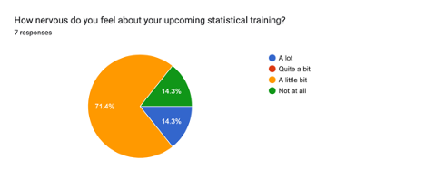
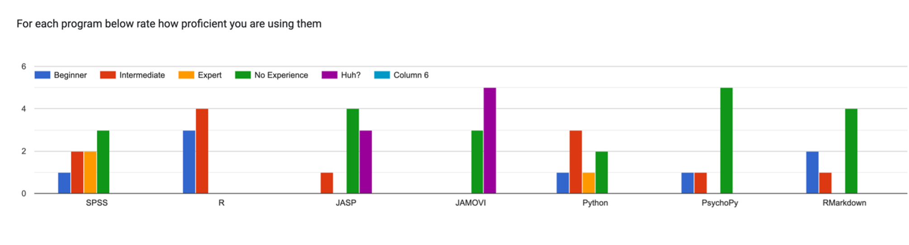

```{r setup, include=FALSE}
options(htmltools.dir.version = FALSE)
knitr::opts_chunk$set(
  fig.width=9, fig.height=3.5, fig.retina=3,
  out.width = "60%",
  cache = FALSE,
  echo = TRUE,
  message = FALSE, 
  warning = FALSE,
  fig.show = TRUE,
  hiline = TRUE
)

hook_source <- knitr::knit_hooks$get('source')
knitr::knit_hooks$set(source = function(x, options) {
  x <- stringr::str_replace(x, "^[[:blank:]]?([^*].+?)[[:blank:]]*#<<[[:blank:]]*$", "*\\1")
  hook_source(x, options)
})
```

```{r xaringan-themer, include=FALSE, warning=FALSE}
library(xaringanthemer)
library(tidyverse)

style_solarized_dark(
  header_font_google = google_font("Aleo"),
  header_h1_font_size = "36px",
  header_color = "black",
  text_font_google = google_font("Aleo"),
  text_font_size = "28px",
  text_color = "black", 
  background_color = "orange", 
  code_font_google = google_font("Share Tech Mono"),
  extra_css = list(
    ".remark-slide-content h2" = list(
      "margin-top" = "2em",
      "margin-bottom" = "2em"
    ),
    .big = list("font-size" = "150%"),
    .small = list("font-size" = "75%"),
    .subtle = list(opacity = "0.6"),
    ".countdown-has-style h3, .countdown-has-style h3 ~ p, .countdown-has-style h3 ~ ul" = list(
      "margin" = "0"
    ),
    ".countdown-has-style pre" = list(
      "margin-top" = "-10px"
    ),
    "p .remark-inline-code" = list(
      "background-color" = "black",
      "padding" = "2px 2px",
      "margin" = "0 -2px"
    ),
    blockquote = list("margin-left" = 0),
    "em" = list(color = "#2aa198")
  ),
)

```
class: center, middle

# Welcome to PSY 503!

---
# About Me

```{r, fig.align='center', echo=FALSE, warning=FALSE}

knitr::include_graphics("jg.jpg")
```
---
# My Journey

```{r echo=FALSE, message=FALSE, warning=FALSE, out.width="100%", out.height="60%"}

library(vistime)
library(tidyverse)
batman_data <- data.frame(

  
   event = c("M.S. DePaul University",
                  "Ph.D. Iowa State University",
                  "Post-doc -  University of Alabama-Birmingham", 
                  "Postdoc - University of Iowa",
             "RuCCS",
                  "Here at Princeton"),

  start = as.character(c("2009-08-09","2012-08-08", "2017-01-08", "2019-04-07", "2020-07-05", "2022-01-07")), 
  end = as.character(c("2012-05-06","2017-08-08", "2019-01-04", "2020-01-07", "2022-01-08", "2023-01-07"))
) 


pp <- gg_vistime(batman_data, optimize_y = FALSE)

pp <- pp + theme(axis.text.x = element_text(size = 20, color = "black", angle = 30))+ 
                   theme(text=element_text(size=12))

pp

```
---
# Research Interests

.pull-left[

- Language processing

  - Mechanisms and representations
      - Auditory and visual word recognition
      - Semantics
          - **Under ambiguity**
- Learning and memory

    - Metamemory
    - Desirable difficulties
]
--

.pull-right[
- Meta-research (philosophy of science)

  - Replication issues in psychology and neuroscience
  ]
---
# Ice Breaker

.pull-left[

<br>
<br>

- Name

- Lab

- Research interests

- Where are you from?

- What is a boring fact about you?

- One fun thing you did during the summer

]

--
.pull-right[
```{r, echo=FALSE, warning=FALSE, out.width="100%", out.height="100%"}

knitr::include_graphics("quant.jpeg")
```
]
---
# Questionaire

```{r echo=FALSE,out.width="75%",fig.cap="",fig.show='hold',fig.align='center'}


``` 
---
# Questionaire

```{r echo=FALSE,out.width="75%",fig.cap="",fig.show='hold',fig.align='center'}


``` 
---
# Questionaire

```{r echo=FALSE,out.width="75%",fig.cap="",fig.show='hold',fig.align='center'}


``` 
---
# Questionaire

```{r echo=FALSE,out.width="75%",fig.cap="",fig.show='hold',fig.align='center'}



``` 
---
background-image: url("nomath.png")
background-position: 100% 100%
background-size: 100% 100%

---
# Questionaire

```{r echo=FALSE,out.width="95%",fig.cap="",fig.show='hold',fig.align='center'}



``` 
---
# Questionnaire Responses

- What statistical methods do you use/plan to use in your research?

  - Computational modeling
  
  - Linear Regression
  
  - Logistic Regression
  
  - PCA/EFA/CFA 
  
  - Multilevel Modeling/MLM 
  
  - ANOVA
---
# Questionnaire Responses

- What topics would you like to see discussed?

  - Bayesian Modeling

  - MLM 

  - How to use R 

  - Non-parametric analyses

  - Power Analysis/Determination
---
# Instructor Contact: 

- Office: PSH 325

- Email: jg9120@princeton.edu

- Cell: 515-520-3464

- Twitter: jgeller_phd

---
# Office Hours

- M 1:00 P.M.- 3:00 P.M.; W 1:00 P.M. - 2:00 P.M. 🪑

- By appointment

  - Calendly: **https://calendly.com/jg9120/30min**

---
# Course Content

- Readings, Assignments, and Schedule: 
  
  - https://psy503-found-stats.netlify.app
  
- I will use Canvas to: 

  - Send announcements  
  
  - Retrieve assignments
  
  - Answer and send emails
  
- I will post html versions of slides day of class (on website). PDFs will be added to the OSF page after class. 
  
---
# Required Text:

- None

**I am going to use a combination of articles and textbook chapters that I will post links to all readings on the course website.**
---
# Class Format

```{r echo=FALSE,out.width="95%",fig.cap="",fig.show='hold',fig.align='center'}

knitr::include_graphics("r.png")

``` 
---
# Precept Time

- Tuesdays: 11-1

# **PSY 505 is required**
---
# My Statistical Goals for You

- Understand the role and philosophy of hypothesis testing

- Rationale and limitations of statistical tests

- Identify the appropriate statistical tests to use

- Perform basic to advanced statistical models in R 

- Build a stronger understanding of probability by using sampling and resampling techniques

- Develop an ability to write and communicate statistical results
---
# Assignments

- 50% Problem Sets (10 x 5) 

- 20% Final Project

- 20% Final Exam 

- 10% Participation
---
# Lectures

- I’ll highlight main concepts

- My role is to introduce you to the basics of each topic and get you started with
examples

-  It is your responsibility to dig deeper when you need and / or want to

-  Graduate studies – learning to be independent and thinking on your own!
---
# Attendance

- No attendance requirements

- If you are sick please stay home

---
# Class Enviroment

I would like to create a learning environment for my students that supports a diversity of thoughts, perspectives and experiences, and honors your identities (including race, gender, class, sexuality, religion, ability, SES, etc. ) To help accomplish this:

 - If you have a name and/or set of pronouns that differ from those that appear in your official Rutgers records, please let me know!
 
- If you feel like your performance in the class is being impacted by your experiences outside of class, please don't hesitate to come and talk with me. I want to be a resource for you. Remember that you can also submit anonymous feedback (which will lead to me making a general announcement to the class, if necessary to address your concerns). 

- I (like many people) am still in the process of learning about diverse perspectives and identities. If something was said in class (by anyone) that made you feel uncomfortable, please talk to me about it. (Again, anonymous feedback is always an option).
---
class: center middle main-title section-title-7
# Questions?


