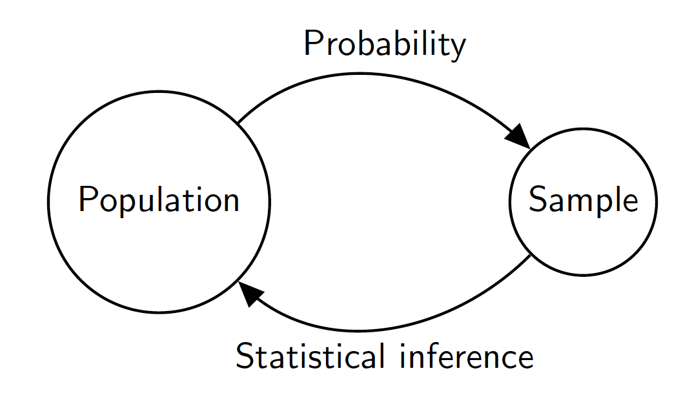
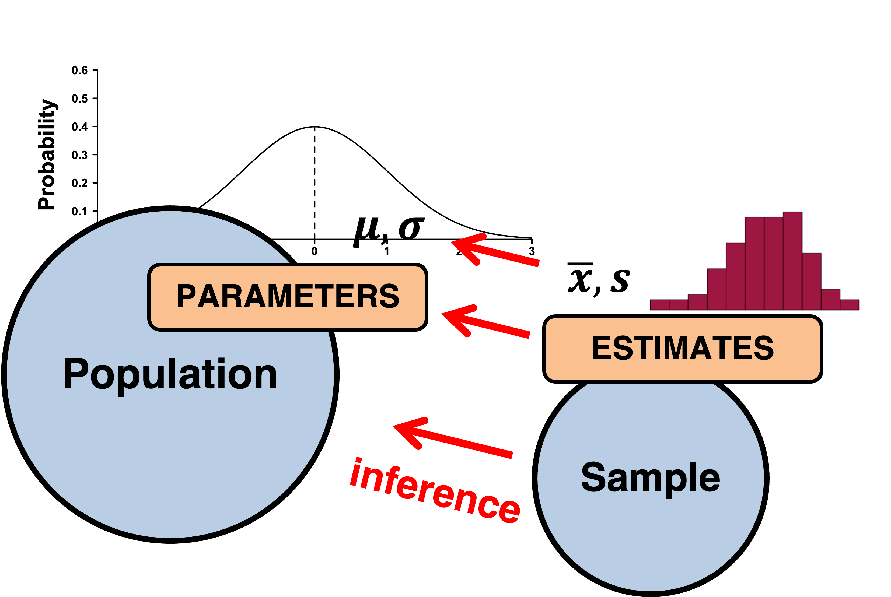
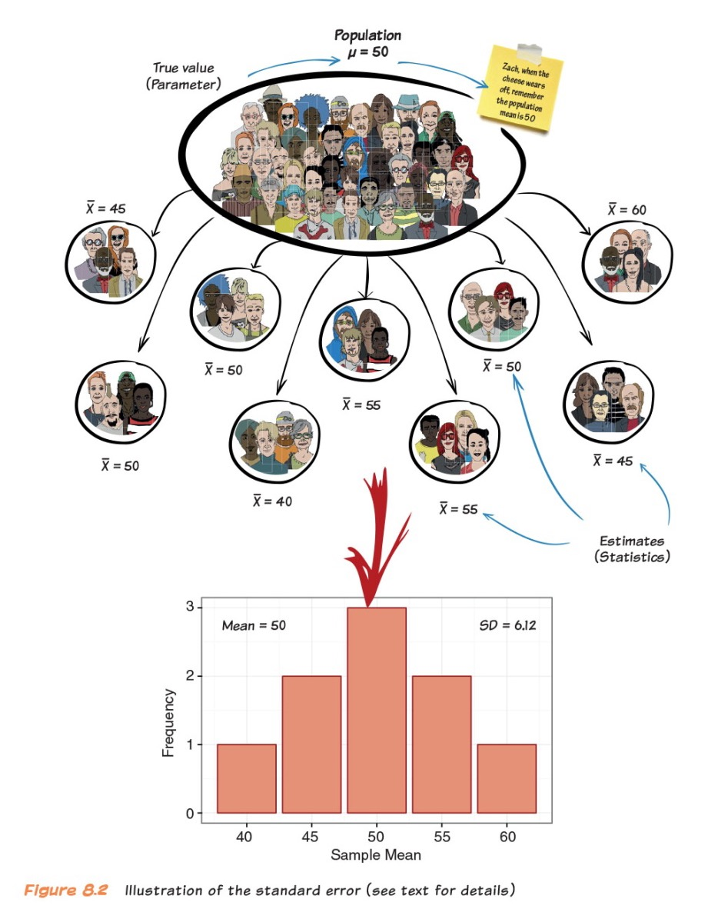
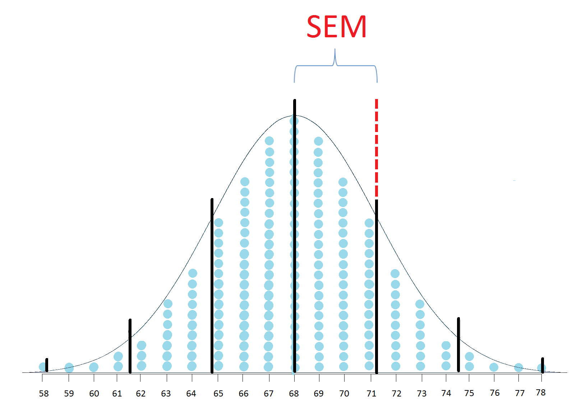
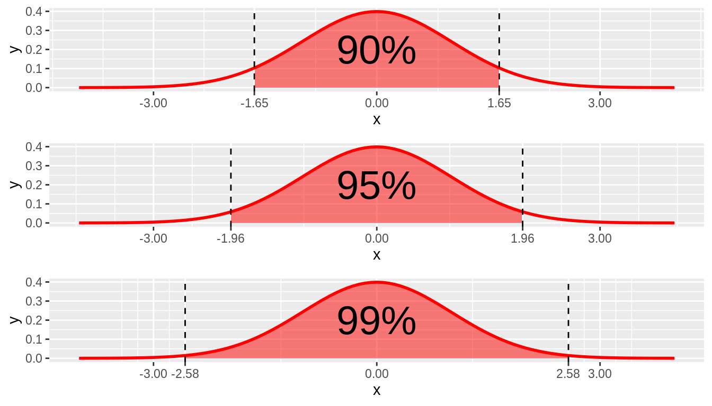
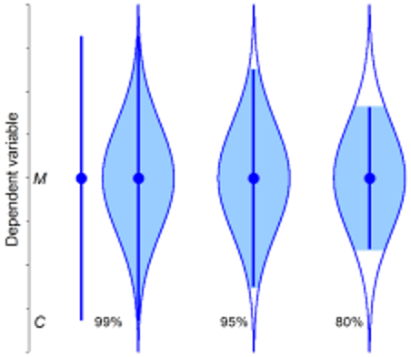
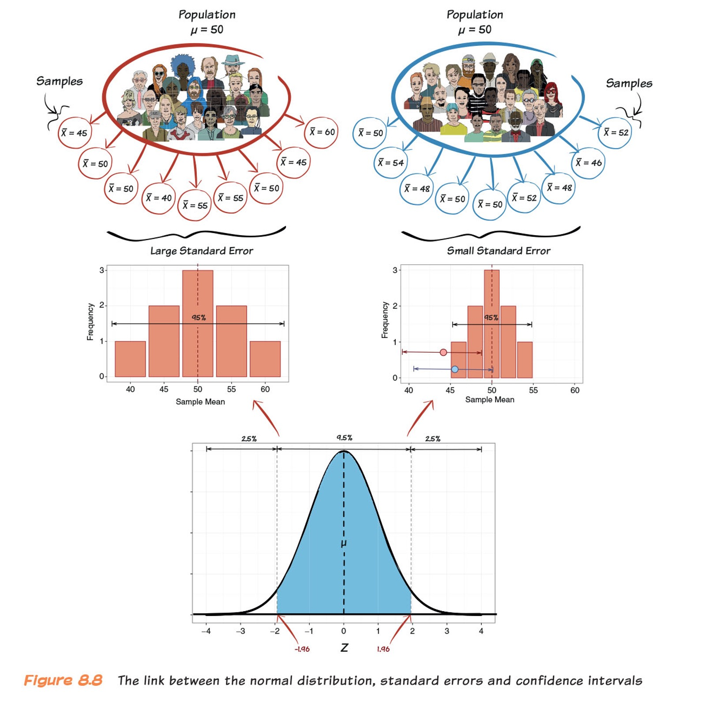

# Where are we going? 

Today: 

  - Statistical Inference
    - Sampling distributions and uncertainty (confidence intervals, margin of error)

Wednesday:

  - Null hypothesis significance testing (p-values, null hypotheses)
  
   **Daniel Lakens is giving talk abut p-values tomorrow (12:00 P.M.)**
---
# Population

.pull-left[

> Entire collection of **units** interested in studying

  - Clearly defined
  - Typically large
  ]
  
.pull-right[
```{r echo=FALSE,out.width="100%", out.height="50%", fig.cap="",fig.show='hold',fig.align='center'}


``` 
]

---
# Sample

.pull-left[
> Smaller subsets of population
]

.pull-right[
```{r echo=FALSE,out.width="65%",fig.cap="",fig.show='hold',fig.align='center'}


``` 
]
---
# Statistical Inference 

```{r echo=FALSE,out.width="65%",fig.cap="",fig.show='hold',fig.align='center'}



``` 

???
The process of statistical inference involves using information from a sample to draw conclusions about a wider population.
Different random samples yield different statistics. We need to be able to describe the sampling distribution of possible statistic values in order to perform statistical inference. We can think of a statistic as a random variable because it takes numerical values that describe the outcomes of the random sampling process. 

---
# Estimation

- Parameters and Statistics

  - __Parameter__  

      - Characteristics of the population
  
  - __Statistics__: Estimates of population parameters 
      - Computed from sample data
        - $\bar{x}$
---

```{r echo=FALSE,out.width="65%",fig.cap="",fig.show='hold',fig.align='center'}



``` 
---
class: middle center

 # Let's say you wanted to know the average height of children in a certain school with a population of 1000 students. You take a sample of 30 children, measure them and find that the mean height is 56 inches. 
 
  -  What is the estimate?
  -  What is the parameter?
---
# Activity

There is a large bowl of balls that contains red and white balls. Importantly, we know that 37.5% of the balls are red

What proportion of this bowl’s balls are red?

1. Pull a random sample of 50

2. Tell me how many % of reds you pulled

```{r}
bowl <- read.csv("https://raw.githubusercontent.com/jgeller112/psy503-psych_stats/master/static/assignment/data/bowl.csv")

virtual_shovel <- bowl %>% 
  sample_n(size = 50)


```
---
# Activity: In Class 

```{r, eval=TRUE, fig.align='center', out.width="60%"}

prop_red=c(.4, .3,.36,.24,.5, .4,.44)

prop_red <-as.data.frame(prop_red)

ggplot(prop_red, aes(x = prop_red)) +
  geom_histogram(binwidth = 0.05, boundary = 0.4, color = "white") +
  labs(x = "Proportion of 50 balls that were red", 
       title = "Distribution of proportions red") 

```
---
# 10,000 times
```{r}
library(moderndive) #get rep_sample_n fucntion
virtual_samples <- bowl %>% 
  rep_sample_n(size = 50, reps = 10000)

virtual_prop_red <- virtual_samples %>% 
  group_by(replicate) %>% 
  summarize(red = sum(color == "red")) %>% 
  mutate(prop_red = red / 50)

```

---
# 10,000 Times

```{r fig.align='center', out.width="50%"}

ggplot(virtual_prop_red, aes(x = prop_red)) +
  geom_histogram(binwidth = 0.05, boundary = 0.4, color = "white") +
  geom_vline(xintercept =.37, colour="green", linetype = "longdash")+
  labs(x = "Proportion of 50 balls that were red", 
       title = "Distribution of 10,000 proportions red") 

```
---
# Sampling Distribution

- The probability distribution of a given statistic (e.g., mean) taken from a random sample
  
  - Distribution of statistics (e.g., mean) that would be produced in an infinite repeated random sampling (with replacement) (**in theory**)


- __IMPORTANT__: Can be any statistic (proportion, mean, standard deviation)
  
---
# Constructing Sampling Distribution

  1.  Randomly draw n sample points from a finite population with size N
  
  2.  Compute statistic of interest
  
  3.  List different observed values of the statistic with their corresponding frequencies
---
# Example: Sampling Distribution of the Mean

- Scores on a statistics test 

```{r echo=FALSE,out.width="30%",fig.cap="",fig.show='hold',fig.align='center'}



``` 
---
# Sampling Error (Standard Error)

```{r echo=FALSE,out.width="65%",fig.cap="",fig.show='hold',fig.align='center'}

knitr::include_graphics('images/sampling_error.jpg')

``` 
---
# Sampling Error (Standard Error)

.pull-left[
- Say it with me: The standard deviation of the sampling distribution is the standard error
- It tells us how much variability there is between sample estimate and population parameter

$$SEM = \sigma/\sqrt(N)$$
]
.pull-right[

```{r echo=FALSE,out.width="80%",fig.cap="",fig.show='hold',fig.align='center'}



``` 
]
???

By dividing by the square root of N, you are paying a “penalty” for using a sample instead of the entire population (sampling allows us to make guesses, or inferences, about a population. The smaller the sample, the less confidence you might have in those inferences; that's the origin of the “penalty”).
---
# SEM 

- Larger SEM means more variability around true mean (low precision)

```{r echo=FALSE,out.width="65%",fig.cap="",fig.show='hold',fig.align='center'}

knitr::include_graphics('images/sampuncert.png')

``` 
---
# A Tale of a Theorem and a Law: Magic

- Central Limit Theorem  

  - Properties:

      1. The distribution of the sample mean approaches the normal distribution as the sample size increases 
      $$\overline x=\mu$$

     2. The standard deviation of the sampling distribution will be equal to the SD of the population divided by the square root of the sample size. s= $\sigma/\sqrt(n)$

Important:**about the shape of distribution**
---
# Central Limit Theorem 

- Why is the Central Limit Theorem so important to the study of sampling distribution?

  - Kicks in regardless of the distribution of the random variable   
  
  - We can use the normal distribution to tell us how far off our own sample mean is from all other possible means, and use this to inform decisions and estimates in null hypothesis statistical testing

---
# Central Limit Theorem

Certain conditions must be met for the CLT to apply:

- Independence: Sampled observations must be independent. This is difficult to verify, but is more likely if

  - Random sampling / assignment is used
  
- Sample size / skew: Either the population distribution is normal, or if the population
distribution is skewed, the sample size is large (> 30)

  - The more skewed the population distribution, the larger sample size we need for the CLT to apply

---
class: middle, center

**Sampling distributions are theoretical, and the researcher does not select an infinite number of samples. Instead, they conduct repeated sampling from a larger population., and use the central limit theorem to build the sampling distribution**

---
# R Simulations

- Let's go to Shiny (http://shiny.calpoly.sh/Sampling_Distribution/)

```{r, out.width="100%",fig.cap="",fig.show='hold',fig.align='center'}

knitr::include_url('http://shiny.calpoly.sh/Sampling_Distribution/')

```
---
# Real Data: 

.pull-left[
```{r, message=FALSE, warning=FALSE, fig.align='center', eval=FALSE}
data("gapminder", package = "dslabs") 
gapminder_2015 <- gapminder %>% 
  filter(year == 2015, !is.na(infant_mortality))
ggplot(gapminder_2015) +
  geom_histogram(aes(x = infant_mortality), color = "black")  +
  xlab("Infant mortality per 1,000 live births") +
  ylab("Number of countries")
```
]

.pull-right[
```{r, message=FALSE, echo=FALSE, warning=FALSE, fig.align='center', out.width="100%"}
data("gapminder", package = "dslabs") 
gapminder_2015 <- gapminder %>% 
  filter(year == 2015, !is.na(infant_mortality))
ggplot(gapminder_2015) +
  geom_histogram(aes(x = infant_mortality), color = "black")  +
  xlab("Infant mortality per 1,000 live births") +
  ylab("Number of countries")
```

]
---
# R Simulations

```{r,message=FALSE, warning=FALSE}
library(infer)
library(cowplot)

sample_5 <- rep_sample_n(gapminder_2015, size = 5, reps = 10000) %>% 
  group_by(replicate) %>% 
  summarise(mean_infant_mortality = mean(infant_mortality)) %>% 
  mutate(n = 5)

sample_30 <- rep_sample_n(gapminder_2015, size = 30, reps = 10000) %>% 
  group_by(replicate) %>% 
  summarise(mean_infant_mortality = mean(infant_mortality)) %>% 
  mutate(n = 30)

sample_100 <- rep_sample_n(gapminder_2015, size = 100, reps = 10000) %>% 
  group_by(replicate) %>% 
  summarise(mean_infant_mortality = mean(infant_mortality)) %>% 
  mutate(n = 100)

all_samples <- bind_rows(sample_5, sample_30, sample_100)

```
---
# Larger N Equates Better Normal Approximation

```{r, fig.align="center",out.width="70%", out.height="10%",  echo=FALSE}

all1=ggplot(sample_5) +
  geom_histogram(aes(x = mean_infant_mortality), color = "white", bins = 50) +
  facet_wrap(~n, ncol = 1, scales = "free_y") +
  xlab("Mean infant mortality") +
  ylab("Number of samples")


all2=ggplot(sample_30) +
  geom_histogram(aes(x = mean_infant_mortality), color = "white", bins = 50) +
  facet_wrap(~n, ncol = 1, scales = "free_y") +
  xlab("Mean infant mortality") +
  ylab("Number of samples")

all3=ggplot(sample_100) +
  geom_histogram(aes(x = mean_infant_mortality), color = "white", bins = 50) +
  facet_wrap(~n, ncol = 1, scales = "free_y") +
  xlab("Mean infant mortality") +
  ylab("Number of samples")

cowplot::plot_grid(all1, all2, all3)
```
---
# Law of Large Numbers

- __Law of large numbers (LLN)__

  - Implies that sample average $\bar{X_n}$ will better approximate $\mathbb{E}[X]$ as sample size increases  

- Super powerful: can be applied in most settings without knowledge of the underlying probability distribution  

__IMPORTANT__:**about the mean**


---
# Law of Large Numbers and Monte Carlo Simulation

- The Law of Large number justifies the use of _Monte Carlo_ simulations 

  - Repeat simulation trials many many times and take the mean of these trials 
  
---
class: middle center

# Measuring Uncertainity

---
# Estimation Error and MOE
<br>
<br>
<br>
- How good is an estimate?  

$$M-\mu$$

---
# Estimation Error and MOE

- MOE (margin of error)

  - Largest likely estimation error 

$$MoE = 1.96 X SE$$
---
- Where did 1.96 come from?

```{r echo=FALSE,out.width="75%",fig.cap="",fig.show='hold',fig.align='center'}



``` 
---
# Combining Estimates Precision

<br>
<br>

- CIs

  - Range of values that are likely to include the true value of the parameter 

  - Allows us to provide point estimate with precision (SE)

---
# CIs

```{r echo=FALSE,out.width="100%",fig.cap="",fig.show='hold',fig.align='center'}


``` 
---

# Anatomy of a Confidence Interval

> **Public support for Proposition A is 53%**

  - 53% support, 95% CI [51, 55]

```{r echo=FALSE,out.width="100%",fig.cap="",fig.show='hold',fig.align='center'}

knitr::include_graphics('images/conf.jpg')

``` 

- Most often calculate 95 % CIs 

---
# Level of Confidence

.pull-left[

- 95 is referred to as confidence level

  - i.e., How confident CI includes $\mu$.
  
- Does not only have to be 95!

  - Greater C = longer CI
]


.pull-right[

```{r echo=FALSE,out.width="100%",fig.cap="",fig.show='hold',fig.align='center'}



``` 

]
---
# How to Calculate CIs

1. Calculate the estimate from your sample

2. Calculate the standard error of your estimate

3. Determine the appropriate sampling distribution for your standardized estimate (e.g., normal)  

4. Determine your desired level of confidence (e.g. 90%, 95%, 99%)


- Lower boundary  = estimate - MoE (1.96 X **SE**)

- Higher boundary = estimate + MoE  (1.96 X **SE**)

---
# Dance of the CIs

> General Interpretation: They tell us if I collected a 100 samples in an identical way, and for each of them calculated the mean and CI, then we would expect 95% of these samples to contain true mean

```{r echo=FALSE,out.width="100%",fig.cap="",fig.show='hold',fig.align='center'}

knitr::include_url('https://logarithmic.net/2017/dance/')

``` 

---
# CI Interpretations

1. CI dance: One from the dance (most likely captures the parameter we are estimating, **but it could not**)

2. Precision: MoE gives us a sense of precision

3. Prediction: CIs give useful information about replication

  - E.g., If a replication is done, 83% chance (5 in 6 chance) 95% CI will capture the next mean
  
.footnote[

[1] Cumming & Calin-Jageman: Introduction to the New Statistics

]
  
---
# CI Example

- Heights of NFL fans

```{r, echo=FALSE, fig.align='center', out.width="60%"}
football_fans <- data.frame(home_fan = rbinom(40000, 1, 0.91),
                            age = rnorm(40000, 30, 8)) %>%
  mutate(age = case_when(age < 0 ~ 0,
                         age >=0 ~ age))
 samples_football_fans <- football_fans %>% 
  rep_sample_n(size =  100, reps = 10000)

samp_means_football_fans <- samples_football_fans %>% 
  group_by(replicate) %>% 
  summarise(xbar = mean(age),
            sigma = sd(football_fans$age),
            n = n(),
            SE_xbar = sigma / sqrt(n))

samp_dist_plot <- 
  ggplot(samp_means_football_fans) +
    geom_histogram(aes(x = xbar), color = "white") +
    geom_vline(xintercept = mean(football_fans$age), color = "blue")
samp_dist_plot

```
---
```{r}
football_fans <- data.frame(home_fan = rbinom(40000, 1, 0.91),
                            age = rnorm(40000, 30, 8)) %>%
  mutate(age = case_when(age < 0 ~ 0,
                         age >=0 ~ age))
 samples_football_fans <- football_fans %>% 
  rep_sample_n(size =  100, reps = 10000)

samp_means_football_fans <- samples_football_fans %>% 
  group_by(replicate) %>% 
  summarise(xbar = mean(age),
            sigma = sd(football_fans$age),
            n = n(),
            SE_xbar = sigma / sqrt(n))

CI <- samp_means_football_fans %>% 
  filter(replicate == 77) %>% 
  summarize(lower = xbar - 1.96*SE_xbar,
            upper = xbar + 1.96*SE_xbar)
CI
```
---

```{r, fig.align='center', out.width="65%", echo=FALSE}
xbar <- samp_means_football_fans %>% 
  filter(replicate == 77) %>% 
  select(xbar) %>% 
  as.numeric()
```
```{r, fig.align='center', out.width="75%", echo=FALSE}
samp_dist_plot +
  shade_ci(CI) +
  geom_vline(xintercept = xbar, color = "red")
```

---
# Dance of the CIs
```{r, echo=FALSE, include=FALSE,  fig.align='center', out.width="100%"}

mu <- football_fans %>% 
  summarize(mean(age)) %>% 
  as.numeric()

CIs_football_fans <- samp_means_football_fans %>% 
  mutate(lower = xbar - 1.96*SE_xbar,
         upper = xbar + 1.96*SE_xbar,
         captured_95 = lower <= mu & mu <= upper)
CIs_football_fans %>% 
  slice(1:5)

CI_subset <- sample_n(CIs_football_fans, 100) %>% 
  mutate(replicate_id = seq(1:100))
```

```{r out.width="50%", fig.align='center', echo=FALSE}
ggplot(CI_subset) +
  geom_point(aes(x = xbar, y = replicate_id, color = captured_95)) +
  geom_segment(aes(y = replicate_id, yend = replicate_id, x = lower, xend = upper, 
                   color = captured_95)) +
  labs(x = expression("Age"),
       y = "Replicate ID",
       title = expression(paste("95% percentile-based confidence intervals for ", 
                             mu, sep = ""))) +
  scale_color_manual(values = c("blue", "orange")) + 
  geom_vline(xintercept = mu, color = "red") 
```


---
# The link between Normal, Standard Errors, and CIs

```{r echo=FALSE,out.width="50%",fig.cap="",fig.show='hold',fig.align='center'}



``` 

---
# What do we do when $\sigma$ unknown?

- USE $s$ -  SD of the sample

$$Z(x) = \frac{x - \mu}{\sigma}$$
  
$$t(x) = \frac{M - \mu}{s/\sqrt(n)}$$
  
$$s = \sqrt{\frac{1}{N-1} \sum_{i=1}^N (x_i - \overline{x})^2}$$
---
# The *t* Distribution

- Small samples: more conservative test

- *t*-distribution has fatter tails 

- Coverage is more conservative 


```{r, echo=FALSE, fig.align='center', out.width="50%", out.height="10%"}

# Generate a vector of 100 values between -6 and 6
x <- seq(-6, 6, length = 100)
  
# Degrees of freedom
df = c(1,4,10,30)
colour = c("red", "orange", "green", "yellow","black")
  
# Plot a normal distribution
plot(x, dnorm(x), type = "l", lty = 2, lwd=4, xlab = "t-value", ylab = "Density", 
     main = "Comparison of t-distributions", col = "black")
  
# Add the t-distributions to the plot
for (i in 1:4){
  lines(x, dt(x, df[i]), col = colour[i])
}
  
# Add a legend
legend("topright", c("df = 1", "df = 4", "df = 10", "df = 30", "normal"), 
       col = colour, title = "t-distributions", lty = c(1,1,1,1,2))
```

???

N-1 is non-biased (not going to concern ourselves with the proof). We are taking sample SD instead of pop SD. It is going to be biased if we dont. 

---
# Degrees of Freedom

- $df = (N-1)$

  - *N* = sample size 

- What is DF you ask?

   - Number of separate independent pieces that can vary
---
# Degrees of Freedom

```{r xaringanExtra-freezeframe, echo=FALSE}
xaringanExtra::use_freezeframe()

knitr::include_graphics('https://user-images.githubusercontent.com/18429968/193103949-421a3f0a-56b3-4fe2-b812-b7cea4c9bc19.gif')

```
---
#Calculating CIs for *t*

$$MoE = t_.95(df) \times s/\sqrt(N)$$
---
# Write-up

- Mean

- 95% CI [lower, upper]


> People who completed the statistics test as  scored *M* = 75.00,
95% CI [70, 80], which was higher than those who completed it as themselves,
*M*= 50.00, 95% CI [35, 65].
