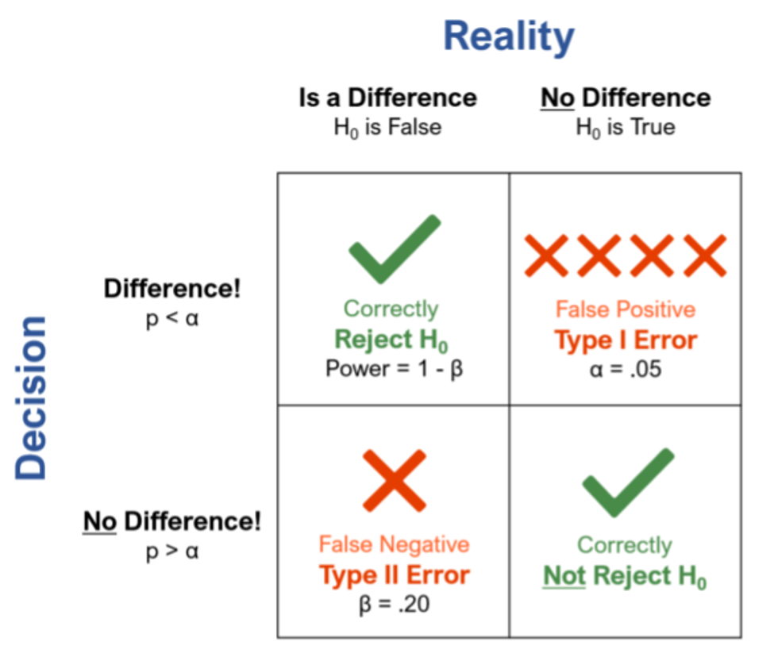

# Knowledge Check

```{r}

shapiro.test(df$Own.Name) # check norm 
shapiro.test(df$Fake.Name) # check norm

t_test=t.test(df$Fake.Name, df$Own.Name, paired = TRUE) # paired

```

---
# Knowledge Check
```{r}
t_test=t.test(df$Fake.Name, df$Own.Name, paired = TRUE) # paired
```

- `r report(t_test)`
---
# Last Class

- Two sample *t*-tests

  - Independent
  
  - Dependent (paired)
  
- Non-parametric tests

- Multiple comparisons
---
# Today

- Effect size

- Statistical Power

  - What is Power?

  - Why do we care about power?

  - Determining Power
  
      - R packages 

---
class:middle center
# Effect Size

- "The amount of anything that's of research interest" (Cumming & Calin-Jageman, 2017, p.111)
---
# Effect Size

- Simple way to quantify the difference between two means / groups, by emphasizing the size of the difference rather than confounding with the sample size (like p-values)

- Small

```{r, echo=FALSE, fig.align='center', out.width="80%"}

knitr::include_graphics("rpsychologist-cohend.svg")

```

---
# Effect Size

- Simple way to quantify the difference between two means / groups, by emphasizing the size of the difference rather than confounding with the sample size (like p-values)

- Medium

```{r, echo=FALSE, fig.align='center', out.width="80%"}

knitr::include_graphics("rpsychologist-cohend (1).svg")

```

---

# Effect Size

- Simple way to quantify the difference between two means / groups, by emphasizing the size of the difference rather than confounding with the sample size (like p-values)

- Large
```{r, echo=FALSE, fig.align='center', out.width="80%"}

knitr::include_graphics("rpsychologist-cohend (2).svg")

```
---
# Effect Size

- Effect size options:

    - Cohen's *d* 
    - Hedges' *g* (*N* < 20)
    - Glass' $\Delta$
    - *r*
  
- Always report an effect size with statistics! 
---
# Cohen's *d*: 1 Sample

$$d = \frac{\bar{X}-\mu}{s}$$

- d = effect size
- $\bar{X}$= sample mean
- $\mu_0$= population mean 
- s = sample standard deviation

---
# Open R  

- From lecture: A cookie company claims that there are 15 chocolate chips per cookie, but you aren’t convinced. You take 10 cookies and count the number of chocolate chips in each cookie. Here is  the data: [13,14,15,17,18,19,21,20,19,20]. Are the number of chocolate chips significantly different from 15 (reminder: yes, p = 0.015)? Report the effect size.

```{r, echo=FALSE}
library(countdown)

countdown(minutes = 3, seconds = 15)
```

---
# Open R  

```{r}

data1 = c(13,14,15,17,18,19,21,20,19,20)
X = mean(data1) 
s = sd(data1)
mu = 15
d = (X - mu) / s
abs(d) # report positive value

```
---
# Effect Size Packages

```{r}
library(effectsize) # easystats package
library(report) # report results
library(MOTE) # erin package effect size

cookie=t.test(data1, mu=15) # perform ttest

effectsize::cohens_d(cookie, data = data1, mu=15) # get cohens_d 

effectsize::hedges_g(cookie, data = data1, mu=15)
# use when N < 20 bias corrected
```
---
- `r report(cookie)`
---
# Cohen's *d*: 2 Sample

$$d = \frac{\bar{X_1} - \bar{X_2}}{SD_{pooled}}$$

- d = effect size
- $\bar{X}$= sample mean
- $\mu_0$= population mean 
- s = sample standard deviation

---
Cohen’s *d*: 2 sample

From last lecture: A math test was given to 300 17 year old students in 1978 and again to another 350 17 year old students in 1992

Group 1: X1 = 300.4, s1 = 34.9, n = 300
Group 2: X2 = 306.7, s2 = 30.1, n = 350

- What is the effect size?

```{r, echo=FALSE}
library(countdown)

countdown(minutes = 0, seconds = 15)
```

---
# Open R  

```{r}

group1 <- rnorm(300, mean = 300.4, sd=34.9) 

group2 <- rnorm(350, mean = 306.7, sd=30.1)

r=t.test(group1, group2)

effectsize::cohens_d(r, data = data1, pooled_sd = TRUE)#nonwelch

effectsize::cohens_d(r, data = data1, pooled_sd = FALSE)#welch

```
---
# Reporting 

- `r report(r)`
---
# Cloak vs. No Cloak Data: Effect Size

- What is the effect size? 

```{r}

longdata <- read_csv("https://raw.githubusercontent.com/doomlab/statsofdoom-files/master/graduate/R%20Flip/11_ttests/data/invisible.csv")
```

---
# Cloak vs. No Cloak Data: Effect Size

```{r echo=TRUE, message=FALSE, warning=FALSE}
library(MOTE)# erin effect size package 
library(rio)

# extract means and sd from cloak df
 M <- longdata  %>%
   group_by(Cloak) %>%
   dplyr::summarize(mean=mean(Mischief), sd=sd(Mischief), N =12)

# run indep t test using MOTE             
effect <- d.ind.t(m1 = M$mean[1], m2 = M$mean[2],        
                  sd1 = M$sd[1], sd2 = M$sd[2],        
                  n1 = 12, n2 = 12, a = .05)
effect$d # get effect size

```

```{r}
# using effect size package
library(effectsize) # effect size package 
cohens_d(Mischief~Cloak, data = longdata)
```
---
# Cloak vs. No Cloak: Effect Size

- While our statistical test indicated no differences, the effect size indicates a medium difference between means

- This difference in interpretation is likely due to low power with a small sample size 
---
# Cohen's *d*: Dependent

- Lots of different ones

  - State which one you are using! 

- $D_{avg}$ - looks at both SDs without controlling for r

$$d_{avg} = \frac{\overline{M_1} - \overline{M_2}}
{\sqrt{\frac{(\sigma_1^2 + \sigma_2^2)}{2}}}$$

-  $d_z$ - we would overestimate the effect size
$$d_{z} = \frac{t}
{\sqrt{n}}$$

---
# Dependent: Effect Size (Lakens, 2013)

- $d_{rm}$ - looks at both SDs and controls for r

$$d_{rm} = \frac{M_1 - M_2}{\sqrt{(SD_1^2 + SD_2^2)  - (2 \times r \times SD_1 \times SD_2)}} \times \sqrt{2 \times (1-r)}$$
- You do not normally have to calculate all of these, just showing how these are different
---
# R 

```{r, echo=FALSE}
countdown(minutes = 5, seconds = 15)
```

Using the cloak data, calculate *d* for dependent samples

Use: 

- `MOTE` d.dep.t.avg(m1, m2, sd1, sd2, n, a = 0.05) ($d_{avg}$)

- `MOTE` d.dep.t.rm(m1, m2, sd1, sd2, r, n, a = 0.05) ($d_{rm}$)

- What Cohen's *d* measure is used in the `effectsize` package?
---
# $d_{avg}$

```{r echo=FALSE, message=FALSE, warning=FALSE}

longdata <- longdata <- read_csv("https://raw.githubusercontent.com/doomlab/statsofdoom-files/master/graduate/R%20Flip/11_ttests/data/invisible.csv")
```

```{r echo=TRUE, message=FALSE, warning=FALSE}

effect2 <- d.dep.t.avg(m1 = M$mean[1], m2 = M$mean[2],      
                  sd1 = M$sd[1], sd2 = M$sd[2],        
                  n=12, a = .05)
effect2$d

```

---
# $d_{rm}$

```{r echo=TRUE, message=FALSE, warning=FALSE}
#MOTE
effect2 <- d.dep.t.rm(m1 = M$mean[1], m2 = M$mean[2],        
                  sd1 = M$sd[1], sd2 = M$sd[2],        
                  n=12, a = .05,  r= .7)

effect2$d

```
---
# $d_z$

```{r echo=TRUE, message=FALSE, warning=FALSE}
#MOTE

diff <- longdata$Mischief[longdata$Cloak == "Cloak"] - longdata$Mischief[longdata$Cloak == "No Cloak"]

effect2.1 = d.dep.t.diff(mdiff = mean(diff, na.rm = T), 
                         sddiff = sd(diff, na.rm = T),
                         n = length(diff), a = .05)
effect2.1$d

```
---
# Effect Size Interpretation

- Cohen (1988)

  - d < 0.2 - Very small

  - 0.2 <= d < 0.5 - Small

  - 0.5 <= d < 0.8 - Medium

  - d >= 0.8 - Large 

---
class: middle

# Power
---
# Recap of NHST

- Do invisibility cloaks increase mischeivous behavior?

  - $H_0$:There is no effect of cloaks on behavior
  - $H_1$: There is an effect of cloaks on behavior
  
---
# Recap of NHST

- A world in which $H_1$ exists

  - Two types of errors: 

```{r, echo=FALSE, fig.align='center', out.width="50%"}



```
---
# Power

- Power $1-\beta$ : Probability rejecting null when it is false 

- **Detecting the effect when it really exists**

```{r, echo=FALSE, fig.align='center', out.width="50%"}

knitr::include_graphics("type1dis.jpg")

```

---
# What is common?

In psychology: 

- β = .20

 - This means we are willing to make a Type II error 20% of the time (i.e., 80% power).

- α =.05
 
  - This means we are willing to make a Type I error only 5% of the time (i.e., significance < .05.

- 1−β = .80 (should be .9)
---
# Power

What does it mean if we say: "we compare retrieval practice to re-reading
with power = .75"

--

 - **If retrieval practice is actually beneficial, there is a
75% chance we’ll get a significant result when we do this study MANY MANY TIMES**

--

- We compare bilinguals to monolinguals on a
test of non-verbal cognition with power = .35

--

- **If there is a difference between monolinguals & bilinguals, there is a 35% chance we’ll get p < .05 IF WE DO THIS MANY MANY TIMES**
---
# Why do we care?

- Efficient use of resources

  - Power analyses tell us if our planned sample size (n) is:

    - Large enough to be able to find what    we’re looking for

     - Not too large that we’re collecting more data than necessary 

- This is about good use of our resources!

    - Societal resources: money, participant hours

    - Your resources: Time!!
  
---
# Why do we care?

- Avoid p-hacking (Simmons et al., 2011)

  - Rate of false positive results increases if we keep collecting data whenever our effect is non-sig
  
 - Power analysis decides sample in advance 
 
---
# Why do we care?

.pull-left[

- Understand non-replication (Open Science
Collaboration, 2015)

  - Even if an effect exists in the population, we’d expect some non-significant results
  
      - Power is almost never 100%
      
      - In fact, many common designs in psychology have low power (Etz & Vandekerckhove, 2016; Maxwell et al., 2015)
] 

.pull-right[

```{r, echo=FALSE, fig.align='center', out.width="100%"}

knitr::include_graphics("rep.jpg")

```
]
---
# Why do we care?

- Understand null results

  - Non-significant result, by itself, doesn’t prove an effect doesn’t exist

  - With high power, null result is more informative

      -  E.g., null effect of cloaks on behavior 20% power
      
          -  Maybe cloaks work & we just couldn’t detect the effect?

           - But: null effect of cloaks on behavior with  power of 90%
         
          - Makes me more sure 
  
---
# Why do we care?

- Granting agencies want them now 

  - Don’t want to fund a study with low probability of showing anything
  
      - e.g., Our theory predicts greater activity in Broca’s area in condition A than condition B. But our experiment has only a 16% probability of detecting the difference. Not good!
---
# Why do we care?

- Scientific accuracy!

  - If there is an effect, we want to know about it!
---
# Power Analysis

- Power analysis: Do we have the
power to detect the effect we’re interested in? If not, what is it going to take?

- Depends on: 

  1. Sample size
  2. Effect size (e.g., d)
  3. Statistical significance criteria (α)
  4. Variability

---
# Power to Estimate Sample Size

- Calculate required sample size given a) effect size (e.g., d) b) significance level (α), c) desired power.

- How do we determine the effect size?

1. Smallest effect size of interest (SESOI) (e.g., d = 0.5) (Lakens)

--

2. A priori

  -  Use literature to estimate effect size (set α, desired power)

--
3. Pilot data

  - Estimate effect size using pilot data (set α, desired power)
---
class: middle, center
**For SESOI, you consider the smallest effect size you care about. For both a priori and pilot data power analyses, you need to get an estimate of the effect size (e.g., d)**

---
# Determining Power

## R Packages

.pull-left[
- `pwr` package
]

.pull-right[
```{r, echo=FALSE, fig.align='center', out.width="50%"}
#install.packages("pwr")
library(pwr)
knitr::include_graphics("pwr_package.jpg")

```
]
- Enter three of the four parameter options above (sample size, effect size, statistical significance, and power) and the package will calculate the fourth parameter.
---
# Determining Power

## R Packages: Power
- `Superpower`
  - https://aaroncaldwell.us/SuperpowerBook/

```{r, eval=TRUE}
#install.packages("Superpower")
library(Superpower)
```

- `Mixedpower`(simulations for more complicated models)
```{r}
# if (!require("devtools")) {
 #   install.packages("devtools", dependencies = TRUE)}

 #  devtools::install_github("DejanDraschkow/mixedpower") 
   
library(mixedpower)
```

---
# A Priori Power

From last lecture: A math test was given to 17 year old students in 1978 and again to another 17 year old students in 1992. From that data we have an estimate of the following parameters

- Group 1: X1 = 300.4, s1 = 34.9, n = 300
- Group 2: X2 = 306.7, s2 = 30.1, n = 350

We want to conduct a similar experiment and estimate how many people we should collect to achieve a desired power of 80%

- What is the effect size?

- Calculate power

---

```{r, eval=FALSE}
library(pwr)
d2abs = .2
pwr.t.test()
```
---
# Power Curves

- Visualization showing power as a function sample size

```{r,fig.align="center", out.width="50%"}


d2abs=.2

p.out <- pwr.t.test(d = d2abs, power = 0.80, sig.level = 0.05,
type = "two.sample", alternative = "two.sided")

plot(p.out)
```
---

- From last lecture: A cookie company claims that there are 15 chocolate chips per cookie, but you aren’t convinced. You take 10 cookies and count the number of chocolate chips in each cookie. Here is what the data looks like: [13,14,15,17,18,19,21,20,19,20]. Are the number of chocolate chips significantly different from 15 (reminder: yes, p = 0.015)?

How many cookies do you need to get 90% power?

---
```{r}
data1 = c(13,14,15,17,18,19,21,20,19,20)

r=t.test(data1, mu=15)

d1=effectsize::cohens_d(r, data = data1, mu=15)
```

---
```{r}
pwr.t.test(d = d1$Cohens_d, power = 0.90, sig.level = 0.05, type = "one.sample", alternative = "two.sided")$n
```
---
# Power Questions

- What would our power be if I could only collect 3 cookies?

- Can calculate current power by slightly adjusting the function
---
```{r, eval=FALSE}

data1 = c(13,14,15,17,18,19,21,20,19,20)

pwr.t.test(n = , d = , power = , sig.level = 0.05,
type = "one.sample", alternative = "two.sided")$power

```
---
Power Question

- Using the cookie data, how many cookies would we need to achieve 90% power?

---

```{r echo=TRUE, message=FALSE, warning=FALSE, eval=FALSE}
library(pwr)
pwr.t.test(n =NULL, d =, #effect size
           sig.level = .05, #alpha
           power = , #power 
           type = "one.sample", #independent
           alternative = "two.sided") #two tailed test
```
---
# Simulation

Remember the definition of power?

- The probability of observing a significant effect in our sample if the effect truly exists in the population

- What if we knew for a fact that the effect existed in a particular population?

  - Then, a measure of power is how often we get a significant result in a sample (of our intended n)

- Solution: We create (“simulate”) the data.
---
# Monte Carlo Simulations

1. Set population parameters
 
 **from already conducted studies or pilot data**

---
# Cloak Data

```{r, fig.align='center'}

design <- "2b"
n <- 12
mu <- c(5, 3.75)
sd <- c(1.65, 1.91)
label_list = list("condition" = c("Cloak", "No Cloak")) #

design_result <- ANOVA_design(design = design,
                              n = n,
                              mu = mu, 
                              sd = sd, 
                              label_list = label_list)
```

---
# Monte Carlo Simulations

1. Set population parameters

2. Create a random sample from these data

3. Do this multiple times 

4. Calculate how many times you get a significant result

  - E.g., 5 out 10 times (50% power)

---

```{r}

nsims=1000 # number of times we do this

power_result_vig_2 <- ANOVA_power(design_result, 
                                  nsims = nsims, 
                                  seed = 1234)
#Note we do not specify any correlation in the ANOVA_design function (default r = 0), nor do we specify an alpha in the ANOVA_power function (default is 0.05)

knitr::kable(confint(power_result_vig_2, level = .98))

```
---
# Power Curve
```{r, fig.align='center'}
plot_power(design_result, min_n = 10, max_n = 250)
```
---
# Dependent: Power

- The test type will affect power, as our independent results suggested we needed 44 or more people

```{r echo=TRUE, message=FALSE, warning=FALSE}
pwr.t.test(n = 12, 
           d = 1.10, 
           sig.level = .05,
           power = NULL, 
           type = "paired", 
           alternative = "two.sided")
```

---
```{r, eval=FALSE}
# if (!require("devtools")) {
 #   install.packages("devtools", dependencies = TRUE)}

 #  devtools::install_github("DejanDraschkow/mixedpower") 
   
library(mixedpower)
   
longdata$id<-rep(1:12, length(longdata))

d_reg<-lme4::lmer(Mischief~Cloak + (1|id),  data=longdata)

d_reg_mixed <- mixedpower(d_reg, data=longdata, fixed_effects = c("Cloak"), simvar = "id", steps = c(20, 30, 40, 50, 60), critical_value = 2)

```
---
# Posthoc Power

- Sometimes reviewers will ask you to conduct a  post-experiment power calculation in order to interpret non-significant findings

  - Do not do this! 

1. Sample effect size not rep of population size

2. Adds nothing over a *p*-value

  - *p* > .05  = low power(Duh!)

---
```{r}
set.seed(11)
x1 <- rnorm(10, mean = 10, sd = 1)
x2 <- rnorm(10, mean = 10.1, sd = 1)

#run t test
# get effect size
```
---
# Posthoc Power

```{r}
#calculate posthoc power from this

```

---
# Posthoc Power 
.pull-left[
<br>
<br>
```{r, eval=TRUE}
sim_out <- replicate(n = 2000, expr = {
  x1 <- rnorm(10, mean = 10, sd = 1)
  x2 <- rnorm(10, mean = 10.1, sd = 1)
  ttest <- t.test(x1, x2, var.equal = TRUE)
  pwr <- power.t.test(delta = diff(ttest$estimate), 
               sd = sqrt((var(x1) + var(x2))/2), 
               sig.level = 0.05,
               n = 10)
  c(pvalue = ttest$p.value, obs_power = pwr$power)
})

```
]

.pull-right[
<br>
<br>

```{r, fig.align='center', out.width="100%"}
plot(t(sim_out),
     xlim = c(0,1), ylim = c(0,1), 
     xlab = "p-value", ylab = "observed power",
     main = "Two-sample t test simulation")
```

]

---
# The Minimal Detectable Effect Size 

- Report the smallest effect size that could be detected in your study for this particular sample size

- We do not live in a perfect world

  - Sometimes we cannot collect all the data we need

